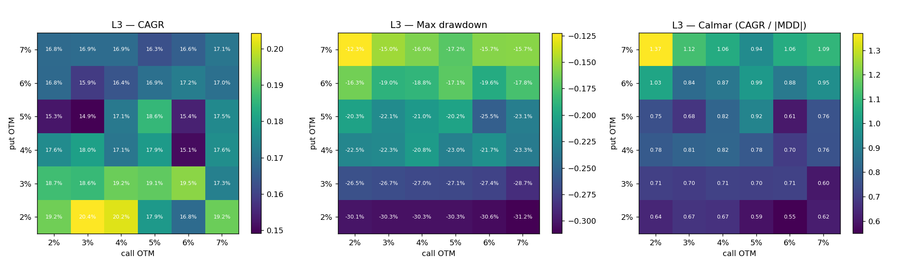

> **Superseded 2026-09-18.** Written before the 15% put stop-loss existed and at 5% / 5% strikes. Every number below is from the pre-stop engine. Current results: `final_results/README.md`.

# Strike selection at 3× leverage — put and call offsets 2–7%

*Brindco NIFTY 50 wheel backtest · prepared 2026-09-18 · all figures reproducible with
`python scripts/wheel/strike_grid.py` (outputs in `data/backtest/report/strike_grid_L3/`).*

## Summary

- **Put distance sets the drawdown; call distance mostly does not.** Averaged over the six call offsets,
  worst drawdown improves steadily as the put moves further out of the money. It is −30.4% at 2% OTM, −27.2% at 3%,
  −22.5% at 4%, −22.3% at 5%, −19.7% at 6% and −18.4% at 7%. Averaged over put offsets, the call offset moves the
  drawdown only between −22.3% and −23.9%, with no pattern.
- **Best return per unit of drawdown (Calmar) in a single cell: put 4% / call 3%.** CAGR 17.84%, worst drawdown
  −20.45%, Calmar 0.87, Sharpe 0.88. That beats the current 5% / 5% (CAGR 14.10%, drawdown −20.48%) by 3.7 CAGR
  points for the same drawdown.
- **The most robust zone is put 6–7% with call 5–7%.** Averaged with its neighbours, this region has the highest
  and flattest Calmar (0.71–0.73). The shallowest drawdown in the grid is put 7% / call 5% (−16.17%, CAGR 13.00%).
- **The case for put 4% / call 3%:** it has the highest return-to-drawdown ratio measured, a Sharpe of 0.88
  (best in the grid), and it collects about 34% more premium than 5% / 5%.
- **The case against it:** it is an isolated peak.
  - Its neighbours are much worse on drawdown: 4% / 2% −24.9%, 4% / 4% −24.3%, 3% / 3% −26.7%.
  - Its worst drawdown falls in March 2020, not the October 2024 episode that sets the drawdown for most cells.
    That suggests it happened to avoid some names at one expiry, not that it has a structural edge.
  - Picking the best of 36 in-sample runs overstates what it will do out of sample.
- **Recommendation:** if Brindco wants the least drawdown with a stable result, use **put 6–7% / call 5–7%**.
  Either **7% / 5%** (lowest drawdown) or **6% / 6%** (CAGR 15.10%, drawdown −20.20%, recovered by
  2026-01-01) is defensible. Treat 4% / 3% as the upper bound of what the data can show, not a setting to rely on.
  Nothing in `params.yaml` has been changed. The headline run is still 5% / 5%.

## Why 3× leverage — defending L3 through premium sold

All figures use the headline 5% / 5% strikes over 2020-01 → 2026-06 on ₹2 crore (`data/backtest/report/analysis/ANALYSIS.md` §3).
Premium kept is premium sold minus buy-backs. **Delivery-leg P&L** is what the stock price did to the book once a put
finished ITM, whether delivered or closed for cash. NAV P&L also includes dividends, costs and cash interest.

| Leverage | Premium kept | Delivery-leg P&L | Share of premium given back | ITM puts closed for cash (unfunded) | NAV P&L | CAGR | Max drawdown |
|---|---|---|---|---|---|---|---|
| L1 | ₹109 L | −₹26 L | 24% | 0 | ₹154 L | 9.17% | −7.65% |
| L2 | ₹283 L | −₹94 L | 33% | 9 | ₹241 L | 12.94% | −13.40% |
| **L3** | **₹413 L** | **−₹196 L** | **47%** | **27** | **₹271 L** | **14.10%** | **−20.48%** |
| L4 | ₹492 L | −₹292 L | 59% | 32 | ₹245 L | 13.12% | −26.45% |
| L5 | ₹576 L | −₹389 L | 67% | 41 | ₹232 L | 12.59% | −35.92% |

**Each extra step of leverage:**

| Step | Extra premium kept | Extra delivery-leg loss | Loss per ₹1 of extra premium | Change in NAV P&L |
|---|---|---|---|---|
| 1× → 2× | +₹175 L | −₹68 L | ₹0.39 | +₹87 L |
| 2× → 3× | +₹130 L | −₹102 L | ₹0.78 | **+₹30 L** |
| 3× → 4× | +₹79 L | −₹96 L | **₹1.22** | **−₹26 L** |
| 4× → 5× | +₹84 L | −₹97 L | ₹1.15 | −₹13 L |

**The case for L3.** L3 is the last step where the extra premium sold pays for the extra stock losses it brings.
1. **Premium grows more slowly than leverage.** Each step adds less premium (+₹175 L, +₹130 L, +₹79 L, +₹84 L).
   The top-ranked names and liquid strikes run out, so extra leverage buys weaker names or larger lots in the same
   names.
2. **The give-back grows faster than premium.** The delivery-leg loss per extra rupee of premium rises from ₹0.39 to
   ₹0.78 to ₹1.22. L3 is the last step below ₹1.
3. **The cash-only rule starts to bind.** With no borrowing, more notional means more ITM puts that cannot be funded
   and are closed at the low: 9 at 2×, 27 at 3×, 41 at 5×.
4. **Result:** L3 has the highest NAV P&L and CAGR of the five. L4 and L5 sell 19–39% more premium than L3 and still
   end with less money.

**The case against L3.**
- **L2 is better risk-adjusted.** Sharpe 0.72 vs 0.69; Calmar 0.97 vs 0.69. L3 adds 1.2 CAGR points for about
  7 more points of drawdown. L2's worst drawdown recovered in 2022; L3's (2024-09-27 → 2025-03-04) had not recovered
  by the end of the window.
- **The 2× → 3× gain is thin.** It is ₹30 L, about 11% of final P&L, and rests on one path through six years. The
  October 2024 expiry alone can reorder the ranking.
- **L3's cash-settled puts are flattered more than L2's.** The 27 unfunded ITM puts are closed at intrinsic value on
  expiry day. In practice brokers square off earlier, at worse prices. A realistic haircut on 27 closes (vs 9 at L2)
  narrows or erases L3's lead.
- **L3 was chosen after the L1–L5 results were seen.** The argument is marginal ("where extra premium stops paying"),
  not a pre-declared choice.

**Framing for Brindco.** L3 maximises premium kept net of the stock losses it causes; beyond 3×, extra premium costs
more than it earns. L2 is the conservative alternative and is the better choice if drawdown matters more than
absolute return.

## Results — all 36 combinations at L3

Rows are the put offset p (put strike ≤ spot × (1 − p)). Columns are the call offset c (call strike ≥ spot × (1 + c)).

**CAGR**

|        | call 2%   | call 3%   | call 4%   | call 5%   | call 6%   | call 7%   |
|:-------|:----------|:----------|:----------|:----------|:----------|:----------|
| put 2% | 15.83%    | 16.14%    | 15.05%    | 14.29%    | 17.01%    | 20.06%    |
| put 3% | 15.92%    | 17.38%    | 15.52%    | 17.30%    | 15.80%    | 16.83%    |
| put 4% | 15.50%    | 17.84%    | 15.86%    | 17.29%    | 14.69%    | 15.02%    |
| put 5% | 12.35%    | 13.07%    | 13.77%    | 14.10%    | 15.34%    | 17.23%    |
| put 6% | 12.54%    | 12.42%    | 14.10%    | 12.69%    | 15.10%    | 12.86%    |
| put 7% | 11.71%    | 13.79%    | 13.66%    | 13.00%    | 14.43%    | 13.63%    |

**Maximum drawdown (peak-to-trough on daily NAV)**

|        | call 2%   | call 3%   | call 4%   | call 5%   | call 6%   | call 7%   |
|:-------|:----------|:----------|:----------|:----------|:----------|:----------|
| put 2% | -30.09%   | -30.30%   | -30.28%   | -30.35%   | -30.62%   | -30.71%   |
| put 3% | -27.64%   | -26.72%   | -26.99%   | -27.10%   | -27.35%   | -27.46%   |
| put 4% | -24.90%   | -20.45%   | -24.27%   | -20.60%   | -23.00%   | -21.76%   |
| put 5% | -22.20%   | -21.93%   | -23.11%   | -20.48%   | -22.01%   | -24.17%   |
| put 6% | -19.11%   | -19.11%   | -19.51%   | -19.21%   | -20.20%   | -21.10%   |
| put 7% | -17.52%   | -19.62%   | -19.41%   | -16.17%   | -19.73%   | -17.78%   |

**Calmar (CAGR ÷ |max drawdown|)**

|        |   call 2% |   call 3% |   call 4% |   call 5% |   call 6% |   call 7% |
|:-------|----------:|----------:|----------:|----------:|----------:|----------:|
| put 2% |      0.53 |      0.53 |      0.5  |      0.47 |      0.56 |      0.65 |
| put 3% |      0.58 |      0.65 |      0.57 |      0.64 |      0.58 |      0.61 |
| put 4% |      0.62 |      0.87 |      0.65 |      0.84 |      0.64 |      0.69 |
| put 5% |      0.56 |      0.6  |      0.6  |      0.69 |      0.7  |      0.71 |
| put 6% |      0.66 |      0.65 |      0.72 |      0.66 |      0.75 |      0.61 |
| put 7% |      0.67 |      0.7  |      0.7  |      0.8  |      0.73 |      0.77 |

**Sharpe (excess of the 3-month T-bill)**

|        |   call 2% |   call 3% |   call 4% |   call 5% |   call 6% |   call 7% |
|:-------|----------:|----------:|----------:|----------:|----------:|----------:|
| put 2% |      0.65 |      0.67 |      0.61 |      0.57 |      0.71 |      0.86 |
| put 3% |      0.67 |      0.78 |      0.65 |      0.77 |      0.66 |      0.71 |
| put 4% |      0.73 |      0.88 |      0.75 |      0.84 |      0.64 |      0.66 |
| put 5% |      0.55 |      0.61 |      0.65 |      0.69 |      0.72 |      0.83 |
| put 6% |      0.61 |      0.6  |      0.71 |      0.58 |      0.77 |      0.59 |
| put 7% |      0.56 |      0.73 |      0.71 |      0.65 |      0.74 |      0.67 |

**NAV P&L on ₹2 crore (₹ lakh)**

|        | call 2%   | call 3%   | call 4%   | call 5%   | call 6%   | call 7%   |
|:-------|:----------|:----------|:----------|:----------|:----------|:----------|
| put 2% | ₹320 L    | ₹329 L    | ₹297 L    | ₹276 L    | ₹355 L    | ₹456 L    |
| put 3% | ₹322 L    | ₹366 L    | ₹311 L    | ₹364 L    | ₹319 L    | ₹350 L    |
| put 4% | ₹310 L    | ₹381 L    | ₹321 L    | ₹364 L    | ₹287 L    | ₹297 L    |
| put 5% | ₹226 L    | ₹244 L    | ₹263 L    | ₹271 L    | ₹306 L    | ₹362 L    |
| put 6% | ₹231 L    | ₹228 L    | ₹271 L    | ₹235 L    | ₹299 L    | ₹239 L    |
| put 7% | ₹211 L    | ₹263 L    | ₹260 L    | ₹242 L    | ₹280 L    | ₹259 L    |

**Return vs drawdown frontier.** A combination is on the frontier if no other one has both a higher CAGR and a
shallower drawdown:

| put / call | CAGR | Max drawdown | Calmar |
|---|---|---|---|
| 7% / 5% | 13.00% | −16.17% | 0.80 |
| 7% / 7% | 13.63% | −17.78% | 0.77 |
| 7% / 4% | 13.66% | −19.41% | 0.70 |
| 6% / 4% | 14.10% | −19.51% | 0.72 |
| 7% / 6% | 14.43% | −19.73% | 0.73 |
| 6% / 6% | 15.10% | −20.20% | 0.75 |
| 4% / 3% | 17.84% | −20.45% | 0.87 |
| 2% / 7% | 20.06% | −30.71% | 0.65 |

## P&L decomposition for the candidate settings

Premium income is premium sold minus buy-backs. **Delivery-leg price P&L** is everything the stock price did once
a put finished in the money: the intrinsic value paid on ITM options at expiry (delivered or cash-settled) plus
the mark-to-market of stock while it was held, excluding dividends. Premium income + delivery-leg price P&L +
dividends − costs + cash interest = NAV P&L, exactly.

|                          | 4% / 3%                                            | 7% / 5%                                            | 6% / 6%                                            | 7% / 7%                                            | 5% / 5%                                    | 2% / 7%                                            |
|:-------------------------|:---------------------------------------------------|:---------------------------------------------------|:---------------------------------------------------|:---------------------------------------------------|:-------------------------------------------|:---------------------------------------------------|
| NAV P&L                  | ₹381.1 L                                           | ₹242.4 L                                           | ₹298.8 L                                           | ₹258.7 L                                           | ₹271.3 L                                   | ₹456.0 L                                           |
| premium sold             | ₹556.7 L                                           | ₹321.7 L                                           | ₹388.0 L                                           | ₹326.9 L                                           | ₹416.1 L                                   | ₹589.6 L                                           |
| premium income           | ₹554.6 L                                           | ₹319.7 L                                           | ₹388.0 L                                           | ₹326.9 L                                           | ₹413.5 L                                   | ₹589.6 L                                           |
| delivery-leg price P&L   | ₹-210.5 L                                          | ₹-142.0 L                                          | ₹-148.3 L                                          | ₹-124.5 L                                          | ₹-195.8 L                                  | ₹-164.9 L                                          |
| dividends                | ₹20.2 L                                            | ₹21.0 L                                            | ₹24.9 L                                            | ₹21.5 L                                            | ₹26.1 L                                    | ₹27.6 L                                            |
| costs                    | −₹35.7 L                                           | −₹21.6 L                                           | −₹25.4 L                                           | −₹22.9 L                                           | −₹27.6 L                                   | −₹34.2 L                                           |
| cash interest            | ₹52.6 L                                            | ₹65.3 L                                            | ₹59.6 L                                            | ₹57.6 L                                            | ₹55.2 L                                    | ₹37.8 L                                            |
| puts sold                | 499                                                | 560                                                | 536                                                | 528                                                | 517                                        | 380                                                |
| delivered                | 18.2%                                              | 10.9%                                              | 12.5%                                              | 11.6%                                              | 14.5%                                      | 22.9%                                              |
| ITM (incl. cash-settled) | 23.2%                                              | 13.8%                                              | 17.0%                                              | 15.0%                                              | 19.7%                                      | 30.8%                                              |
| cash-settled ITM puts    | 25                                                 | 16                                                 | 24                                                 | 18                                                 | 27                                         | 30                                                 |
| call-away rate           | 82.4%                                              | 82.0%                                              | 82.1%                                              | 80.3%                                              | 81.3%                                      | 83.9%                                              |
| days held after delivery | 142                                                | 167                                                | 177                                                | 178                                                | 165                                        | 212                                                |
| worst DD                 | -20.45% (2020-01-24 → 2020-04-03, rec. 2020-06-22) | -16.17% (2022-01-13 → 2022-06-17, rec. 2022-11-24) | -20.20% (2024-09-27 → 2025-02-28, rec. 2026-01-01) | -17.78% (2024-09-27 → 2025-01-27, rec. 2025-08-19) | -20.48% (2024-09-27 → 2025-03-04, rec. no) | -30.71% (2020-01-15 → 2020-03-30, rec. 2020-07-21) |

**Reading the decomposition.**
- **Closer puts collect more premium and pay a lot of it back on the delivery leg.** 4% / 3% sells ₹556.7 L of
  premium and gives back ₹210.5 L. 7% / 5% sells ₹321.7 L and gives back ₹142.0 L.
- **Wider calls earn more by keeping more upside.** At 2% puts, moving the call from 3% to 7% cuts the delivery-leg
  loss from ₹385.9 L to ₹164.9 L, because assigned stock is called away higher. That is why 2% / 7% has the
  highest CAGR, despite a −30.7% drawdown.
- **Cash interest is a large share of every setting (₹38–65 L).** Settings that sell less premium hold more cash
  and earn more interest. See assumption 9.

## Methodology

1. **Strategy.** Monthly wheel on NIFTY 50 stock options.
   - Sell cash-secured puts on up to 20 names ranked by the trend score (`rank_final` > 1.5), one expiry at a time.
   - Take delivery on assignment, then write covered calls until the shares are called away.
2. **Universe.** NIFTY 50 membership **as of each expiry**, rebuilt from NSE Indices press releases. Stocks that
   later left the index (YESBANK, ZEEL, VEDL, HDFC and others) are included while they were members.
3. **Window and capital.** First signal 2019-12-31, first trade 2020-01-01, last day 2026-06-30. ₹2 crore start.
4. **Leverage (L3).**
   - Each short option reserves strike × quantity ÷ 3 of margin.
   - Target notional per name is 3 × NAV ÷ 20.
   - Total required margin may not exceed NAV.
5. **Strike rule tested here.**
   - Put: the highest liquid listed strike at or below spot × (1 − p). Call: the lowest liquid listed strike at
     or above spot × (1 + c). So p and c are minimum distances.
   - The strike must lie within max(1.5% of spot, one strike interval) of that target.
   - Covered calls are never written below the economic cost basis of the delivered stock (strike − premium +
     costs), so c is a minimum.
   - p and c each take the values 2, 3, 4, 5, 6 and 7%, which gives 36 full backtests. Every other parameter is
     identical to the headline run.
6. **Timing.**
   - Decisions are made on day t's close and filled at day t+1's close.
   - A fill needs at least 10 contracts traded and 50 contracts of open interest on the signal day. An order is
     capped at 10% of the day's volume and retried up to 3 times.
7. **Settlement.**
   - ITM options settle at NSE's final settlement price, the cash-market close on expiry day.
   - Assignment is physical delivery, but only if free cash covers strike × quantity plus costs (cash-only rule,
     no borrowing).
   - ITM puts without enough cash are closed at intrinsic value on expiry day.
8. **Costs.** Date-effective statutory and broker charges:
   - STT on option premium (0.05% → 0.0625% → 0.1% → 0.15%), and 0.1% delivery STT on physical settlement.
   - NSE transaction charges, SEBI fee, and stamp duty on the buy side.
   - ₹20 per option order, 0.25% on physical delivery, DP charge, 18% GST.
9. **Slippage.** Every option fill is the close ∓ max(2 ticks, 2.5% of premium). Stock sales lose 5 bps.
   Settlement at the strike has no slippage.
10. **Cash.** Idle cash earns the month's 3-month T-bill rate. The same rate is the Sharpe/Sortino hurdle.
11. **Dividends and corporate actions.**
    - Held stock receives cash dividends.
    - Splits, bonuses, rights and demergers follow NSE's contract adjustments.
    - Where a rights adjustment grows the option lot above the shares held, the missing shares are bought at the
      adjusted close so the call stays covered. This rule was added during this study, after the ADANIENT
      rights adjustment (2025-11-17) left one grid run with a partly uncovered call. It does not change the
      headline runs.
12. **Metrics.**
    - CAGR on daily NAV; volatility is the annualised standard deviation of daily returns.
    - Max drawdown is the worst peak-to-trough fall in daily NAV; Calmar = CAGR ÷ |max drawdown|.
    - Every run reconciles NAV to trade-level P&L to the rupee.

## Assumptions and limitations Brindco should weigh

1. **In-sample selection.** The grid is scored on the same 2020–2026 window it describes. The best cell of 36 is
   partly luck. Prefer a flat region over a single peak, and ideally confirm on a later, separate period.
2. **One dominant episode.** For most settings the worst drawdown is the October 2024 expiry, when a full book of
   puts opened the day after NIFTY's all-time high went ITM together. With 78 monthly expiries, drawdown rankings
   rest on very few independent events.
3. **Closing unfunded ITM puts at intrinsic value is optimistic.** In practice brokers raise delivery margins in
   expiry week and square off before expiry, at prices that still include time value and spread. Settings with
   more cash-settled puts (the column above) are flattered most.
4. **The margin model is simplified.** Margin is strike ÷ leverage, not NSE's SPAN + exposure margin. Exchange
   margin increases in stress (for example March 2020) and the expiry-week delivery margin ramp are not modelled.
5. **Fills use end-of-day prices.** There is no bid/ask. Slippage is an explicit assumption; the base level is used
   here, and `ANALYSIS.md` §6 shows the slippage sensitivity.
6. **Strike availability.** Only listed strikes are used, so at wide strike intervals nominally different offsets
   (for example 6% and 7%) can land on the same strike.
7. **Broker charges** are Zerodha's 2026 schedule applied back to 2019. **Results are pre-tax.**
8. **Survivorship residue.** Four index members (HDFC, INFRATEL, LTIM, ZEEL) lack the 15-minute data the ranking
   needs for part of the window. The measured effect is under about 1 CAGR point.
9. **Cash interest** (₹38–65 L here) assumes idle cash earns T-bill yield. A broker pays nothing on margin cash;
   earning it needs liquid funds or T-bills pledged as collateral.
10. **Rank threshold.** The 1.5 threshold was itself chosen on this window. Strike results are conditional on it.

## Files

- `data/backtest/report/strike_grid_L3/grid.csv`: every run's metrics, P&L decomposition and wheel diagnostics.
- `data/backtest/report/strike_grid_L3/pivot_*.csv`: the tables above.
- `data/backtest/report/strike_grid_L3/heatmaps.png`: the heatmaps.
- `scripts/wheel/strike_grid.py`: reproduces everything above.
- `data/backtest/report/analysis/ANALYSIS.md`: full metrics, benchmarks, stress walk-through and biases for the
  headline L3 run.
