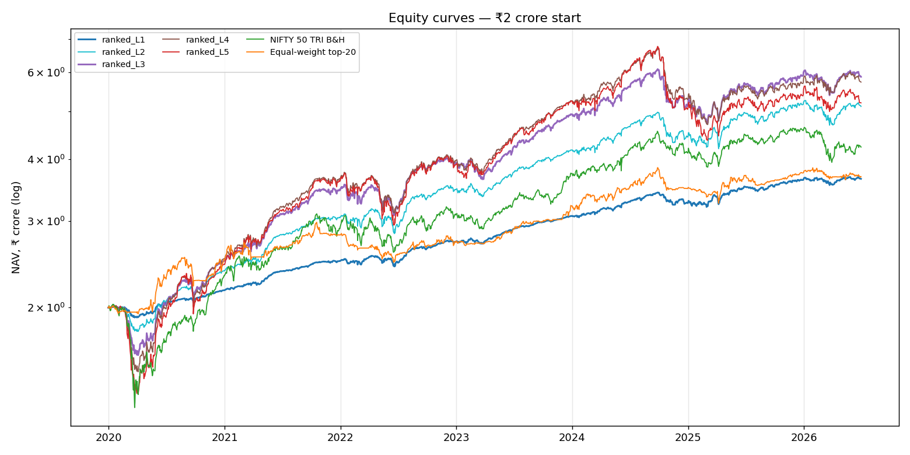
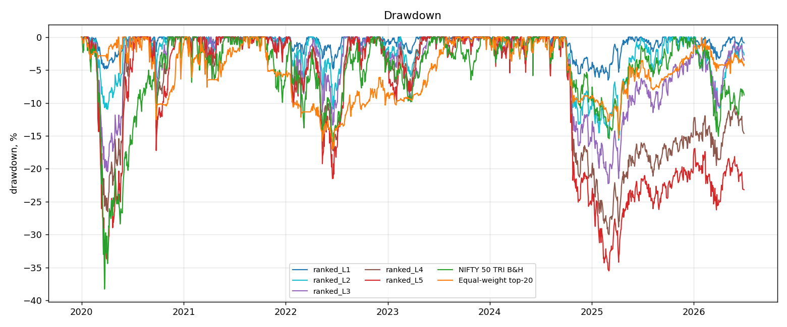
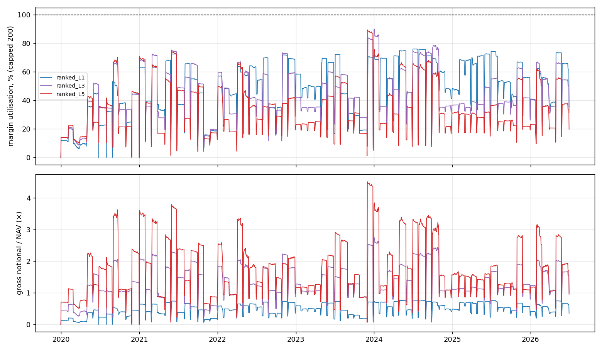

# Leveraged Wheel Backtest — Top-20 Ranked NIFTY 50

Window 2019-12-31 → 2026-06-30 · capital ₹2 crore · first signal 2019-12-31 · slippage `base` · margin financing 10% p.a. · idle cash earns the monthly India 3M T-bill rate (Sharpe/Sortino in excess of it) · all parameters in `params.yaml` and fixed before results.

## 6. Performance comparison

### Absolute P&L and drawdown
| series              | final_nav   | total_pnl   | cagr   | max_drawdown   |
|:--------------------|:------------|:------------|:-------|:---------------|
| ranked_L1           | ₹365.00 L   | ₹165.00 L   | 9.70%  | -6.54%         |
| ranked_L2           | ₹511.83 L   | ₹311.83 L   | 15.56% | -15.67%        |
| ranked_L3           | ₹587.74 L   | ₹387.74 L   | 18.05% | -22.25%        |
| ranked_L4           | ₹573.54 L   | ₹373.54 L   | 17.60% | -29.99%        |
| ranked_L5           | ₹520.43 L   | ₹320.43 L   | 15.86% | -35.50%        |
| NIFTY 50 TRI B&H    | ₹423.33 L   | ₹223.33 L   | 12.23% | -38.27%        |
| Equal-weight top-20 | ₹368.83 L   | ₹168.83 L   | 9.88%  | -17.00%        |

### Risk-adjusted
| series              | ann_vol   |   sharpe |   sortino |   calmar |
|:--------------------|:----------|---------:|----------:|---------:|
| ranked_L1           | 4.89%     |     0.88 |      1.22 |     1.48 |
| ranked_L2           | 10.67%    |     0.94 |      1.31 |     0.99 |
| ranked_L3           | 13.82%    |     0.91 |      1.26 |     0.81 |
| ranked_L4           | 16.35%    |     0.77 |      1.05 |     0.59 |
| ranked_L5           | 19.29%    |     0.6  |      0.82 |     0.45 |
| NIFTY 50 TRI B&H    | 17.99%    |     0.45 |      0.61 |     0.32 |
| Equal-weight top-20 | 10.46%    |     0.47 |      0.65 |     0.58 |

### Capital efficiency and leverage impact
| series    |   avg_gross_exposure_x_nav | avg_margin_util   | max_margin_util   | return_on_deployed_capital   | return_on_leveraged_capital   |   margin_call_liquidations | financing_cost   | cash_interest_income   |
|:----------|---------------------------:|:------------------|:------------------|:-----------------------------|:------------------------------|---------------------------:|:-----------------|:-----------------------|
| ranked_L1 |                       0.49 | 48.73%            | 76.00%            | 17.88%                       | 17.88%                        |                          0 | ₹-0.00 L         | ₹74.45 L               |
| ranked_L2 |                       1.05 | 51.85%            | 89.74%            | 24.28%                       | 12.14%                        |                          0 | ₹-0.00 L         | ₹60.80 L               |
| ranked_L3 |                       1.34 | 44.23%            | 89.87%            | 31.75%                       | 10.58%                        |                          0 | ₹-0.00 L         | ₹53.46 L               |
| ranked_L4 |                       1.59 | 39.13%            | 89.36%            | 33.80%                       | 8.45%                         |                          0 | ₹-0.00 L         | ₹52.79 L               |
| ranked_L5 |                       1.78 | 35.18%            | 89.40%            | 33.31%                       | 6.66%                         |                          0 | ₹-0.00 L         | ₹49.72 L               |

## Portfolio-level metrics (all runs)

|                                            | ranked_L1   | ranked_L2   | ranked_L3   | ranked_L4   | ranked_L5   |
|:-------------------------------------------|:------------|:------------|:------------|:------------|:------------|
| total_pnl                                  | ₹165.00 L   | ₹311.83 L   | ₹387.74 L   | ₹373.54 L   | ₹320.43 L   |
| final_nav                                  | ₹365.00 L   | ₹511.83 L   | ₹587.74 L   | ₹573.54 L   | ₹520.43 L   |
| total_return                               | 82.50%      | 155.92%     | 193.87%     | 186.77%     | 160.21%     |
| cagr                                       | 9.70%       | 15.56%      | 18.05%      | 17.60%      | 15.86%      |
| annualized_return                          | 9.57%       | 15.34%      | 17.90%      | 17.90%      | 16.90%      |
| annualized_vol                             | 4.89%       | 10.67%      | 13.82%      | 16.35%      | 19.29%      |
| sharpe                                     | 0.88        | 0.94        | 0.91        | 0.77        | 0.60        |
| sortino                                    | 1.22        | 1.31        | 1.26        | 1.05        | 0.82        |
| max_drawdown                               | -6.54%      | -15.67%     | -22.25%     | -29.99%     | -35.50%     |
| max_dd_peak                                | 2024-09-27  | 2024-09-27  | 2024-09-27  | 2024-09-27  | 2024-09-27  |
| max_dd_trough                              | 2025-02-28  | 2025-04-07  | 2025-02-28  | 2025-03-03  | 2025-03-03  |
| max_dd_recovered                           | 2025-05-12  | 2025-09-19  | n/a         | n/a         | n/a         |
| calmar                                     | 1.48        | 0.99        | 0.81        | 0.59        | 0.45        |
| option_trade_win_rate                      | 79.67%      | 80.40%      | 78.85%      | 80.43%      | 81.03%      |
| cycle_win_rate                             | 95.50%      | 95.04%      | 93.16%      | 90.11%      | 88.69%      |
| avg_trade_pnl                              | ₹0.08 L     | ₹0.25 L     | ₹0.38 L     | ₹0.43 L     | ₹0.43 L     |
| avg_option_trade_pnl                       | ₹-0.01 L    | ₹-0.02 L    | ₹-0.08 L    | ₹-0.08 L    | ₹-0.06 L    |
| avg_monthly_return                         | 0.77%       | 1.25%       | 1.47%       | 1.48%       | 1.43%       |
| best_month                                 | 5.13%       | 9.99%       | 13.86%      | 13.74%      | 16.35%      |
| best_month_date                            | 2025-03     | 2022-07     | 2022-07     | 2022-07     | 2022-07     |
| worst_month                                | -4.00%      | -10.23%     | -13.85%     | -17.57%     | -21.61%     |
| worst_month_date                           | 2024-10     | 2024-10     | 2024-10     | 2024-10     | 2020-03     |
| pct_positive_months                        | 72.15%      | 68.35%      | 67.09%      | 69.62%      | 64.56%      |
| profit_factor                              | 1.80        | 1.81        | 1.69        | 1.57        | 1.44        |
| premium_collected                          | ₹148.41 L   | ₹403.92 L   | ₹577.84 L   | ₹694.24 L   | ₹785.39 L   |
| option_pnl                                 | ₹4.27 L     | ₹10.00 L    | ₹-32.22 L   | ₹-24.04 L   | ₹-6.69 L    |
| stock_pnl                                  | ₹97.10 L    | ₹268.99 L   | ₹404.77 L   | ₹383.19 L   | ₹312.89 L   |
| transaction_costs                          | ₹10.81 L    | ₹27.97 L    | ₹38.27 L    | ₹38.40 L    | ₹35.48 L    |
| financing_cost                             | ₹-0.00 L    | ₹-0.00 L    | ₹-0.00 L    | ₹-0.00 L    | ₹-0.00 L    |
| cash_interest_income                       | ₹74.45 L    | ₹60.80 L    | ₹53.46 L    | ₹52.79 L    | ₹49.72 L    |
| n_puts_sold                                | 610         | 574         | 505         | 480         | 455         |
| n_calls_sold                               | 472         | 431         | 346         | 261         | 204         |
| n_assignments                              | 128         | 112         | 95          | 68          | 51          |
| assignment_rate                            | 20.98%      | 19.51%      | 18.81%      | 14.17%      | 11.21%      |
| n_calls_exercised                          | 109         | 97          | 83          | 58          | 43          |
| n_completed_wheel_cycles                   | 106         | 92          | 79          | 55          | 40          |
| n_cycles_closed                            | 600         | 565         | 497         | 475         | 451         |
| avg_completed_cycle_days                   | 130         | 135         | 135         | 146         | 135         |
| avg_closed_cycle_days                      | 48          | 48          | 46          | 43          | 40          |
| avg_capital_utilization                    | 50.41%      | 54.60%      | 45.87%      | 40.53%      | 36.32%      |
| avg_margin_utilization                     | 48.73%      | 51.85%      | 44.23%      | 39.13%      | 35.18%      |
| max_margin_utilization                     | 76.00%      | 89.74%      | 89.87%      | 89.36%      | 89.40%      |
| max_margin_utilization_date                | 2024-07-05  | 2024-10-07  | 2024-01-03  | 2023-12-04  | 2023-12-01  |
| n_margin_call_liquidations                 | 0           | 0           | 0           | 0           | 0           |
| margin_breach_days                         | 0           | 0           | 0           | 0           | 0           |
| avg_leveraged_requirement                  | ₹142.06 L   | ₹197.68 L   | ₹187.97 L   | ₹170.12 L   | ₹148.05 L   |
| avg_unleveraged_requirement                | ₹142.06 L   | ₹395.37 L   | ₹563.91 L   | ₹680.47 L   | ₹740.26 L   |
| avg_notional_exposure                      | ₹143.77 L   | ₹400.06 L   | ₹570.72 L   | ₹688.49 L   | ₹749.15 L   |
| avg_gross_exposure_x_nav                   | 0.49×       | 1.05×       | 1.34×       | 1.59×       | 1.78×       |
| max_gross_exposure_x_nav                   | 0.77×       | 1.84×       | 2.74×       | 3.60×       | 4.51×       |
| max_borrowed                               | ₹0.00 L     | ₹0.00 L     | ₹0.00 L     | ₹0.00 L     | ₹0.00 L     |
| days_borrowing                             | 0           | 0           | 0           | 0           | 0           |
| n_itm_puts_physically_assigned             | 128         | 112         | 95          | 68          | 51          |
| n_itm_puts_not_delivered_insufficient_cash | 0           | 4           | 17          | 32          | 36          |
| n_forced_realisations                      | 0           | 4           | 17          | 32          | 36          |
| forced_realisation_loss                    | ₹0.00 L     | ₹9.50 L     | ₹41.85 L    | ₹124.37 L   | ₹173.63 L   |
| assignment_costs                           | ₹5.55 L     | ₹14.55 L    | ₹19.88 L    | ₹19.97 L    | ₹18.45 L    |
| cash_rejected_delivery_prevented           | ₹0.00 L     | ₹197.27 L   | ₹1,038.45 L | ₹2,750.01 L | ₹3,578.49 L |
| n_cash_settlement_forced_stock_sales       | 0           | 0           | 0           | 1           | 0           |
| forced_stock_sale_value                    | ₹0.00 L     | ₹0.00 L     | ₹0.00 L     | ₹40.81 L    | ₹0.00 L     |
| n_cash_settlement_forced_call_buybacks     | 0           | 0           | 0           | 0           | 0           |
| min_free_cash                              | ₹135.04 L   | ₹6.00 L     | ₹4.27 L     | ₹2.09 L     | ₹2.41 L     |
| min_free_cash_date                         | 2025-02-27  | 2022-02-24  | 2021-03-25  | 2021-03-25  | 2026-03-30  |
| max_cash_utilization                       | 59.64%      | 97.95%      | 98.36%      | 99.29%      | 99.52%      |
| return_on_deployed_capital                 | 17.88%      | 24.28%      | 31.75%      | 33.80%      | 33.31%      |
| return_on_leveraged_capital                | 17.88%      | 12.14%      | 10.58%      | 8.45%       | 6.66%       |
| return_on_avg_nav                          | 9.01%       | 13.26%      | 14.56%      | 13.70%      | 12.10%      |
| annual_premium_turnover_x_nav              | 8.11%       | 17.17%      | 21.71%      | 25.46%      | 29.66%      |
| annual_notional_sold_x_nav                 | 6.38×       | 13.97×      | 17.52×      | 20.63×      | 23.04×      |
| liquidation_cost_estimate_at_end           | ₹0.20 L     | ₹0.59 L     | ₹0.86 L     | ₹0.82 L     | ₹0.79 L     |
| n_open_positions_at_end                    | 10          | 9           | 8           | 5           | 4           |

## 5. Monthly returns

|         | ranked_L1   | ranked_L2   | ranked_L3   | ranked_L4   | ranked_L5   | NIFTY 50 TRI B&H   | Equal-weight top-20   |
|:--------|:------------|:------------|:------------|:------------|:------------|:-------------------|:----------------------|
| 2019-12 | 0.0%        | 0.0%        | 0.0%        | 0.0%        | 0.0%        | 0.0%               | 0.0%                  |
| 2020-01 | -0.2%       | -0.7%       | -1.4%       | -1.9%       | -2.4%       | -1.7%              | -2.6%                 |
| 2020-02 | -1.2%       | -2.9%       | -5.5%       | -7.2%       | -9.3%       | -6.3%              | 0.2%                  |
| 2020-03 | -2.6%       | -6.2%       | -12.2%      | -16.3%      | -21.6%      | -23.0%             | 0.6%                  |
| 2020-04 | 2.2%        | 4.8%        | 8.6%        | 11.8%       | 16.0%       | 14.7%              | 1.7%                  |
| 2020-05 | 2.1%        | 4.1%        | 6.4%        | 8.8%        | 10.0%       | -2.7%              | 7.7%                  |
| 2020-06 | 2.0%        | 4.3%        | 7.0%        | 7.3%        | 8.0%        | 7.6%               | 6.2%                  |
| 2020-07 | 1.1%        | 3.3%        | 5.7%        | 7.4%        | 9.5%        | 7.7%               | 5.2%                  |
| 2020-08 | 0.2%        | 3.1%        | 5.5%        | 7.2%        | 9.4%        | 3.0%               | 1.2%                  |
| 2020-09 | 0.5%        | -1.9%       | -4.9%       | -7.2%       | -10.4%      | -1.2%              | -6.6%                 |
| 2020-10 | 1.2%        | 2.8%        | 4.0%        | 4.3%        | 4.5%        | 3.7%               | -0.3%                 |
| 2020-11 | 1.5%        | 4.8%        | 7.5%        | 8.1%        | 7.3%        | 11.4%              | 3.0%                  |
| 2020-12 | 1.5%        | 2.5%        | 3.8%        | 5.0%        | 6.4%        | 7.8%               | 7.2%                  |
| 2021-01 | 0.5%        | 1.1%        | 1.7%        | 2.0%        | 2.5%        | -2.5%              | 0.6%                  |
| 2021-02 | 1.2%        | 1.4%        | 2.3%        | 3.5%        | 4.1%        | 6.7%               | 2.0%                  |
| 2021-03 | 1.6%        | 2.8%        | 3.4%        | 3.1%        | 4.1%        | 1.2%               | -1.1%                 |
| 2021-04 | 1.0%        | 2.4%        | 3.3%        | 2.9%        | 1.8%        | -0.4%              | -0.0%                 |
| 2021-05 | 3.3%        | 6.5%        | 8.2%        | 8.7%        | 8.3%        | 6.7%               | 3.0%                  |
| 2021-06 | 1.3%        | 2.8%        | 3.4%        | 4.5%        | 4.7%        | 1.1%               | 1.6%                  |
| 2021-07 | 0.4%        | 0.5%        | 0.6%        | 0.9%        | -0.2%       | 0.4%               | 1.1%                  |
| 2021-08 | 1.8%        | 3.5%        | 4.9%        | 5.8%        | 6.4%        | 8.7%               | 3.2%                  |
| 2021-09 | 1.0%        | 1.8%        | 2.8%        | 3.4%        | 3.7%        | 2.9%               | 0.9%                  |
| 2021-10 | 1.1%        | 1.8%        | 2.6%        | 2.8%        | 3.8%        | 0.4%               | 1.2%                  |
| 2021-11 | -0.2%       | -0.7%       | -1.5%       | -1.5%       | -1.6%       | -3.8%              | -0.9%                 |
| 2021-12 | 0.9%        | 1.4%        | 2.3%        | 2.0%        | 2.3%        | 2.2%               | 0.3%                  |
| 2022-01 | -0.9%       | -2.3%       | -3.9%       | -5.3%       | -5.7%       | -0.1%              | -4.6%                 |
| 2022-02 | 0.7%        | 1.5%        | 1.2%        | 1.8%        | 3.1%        | -3.0%              | -1.6%                 |
| 2022-03 | 1.8%        | 3.2%        | 3.9%        | 4.0%        | 3.7%        | 4.0%               | 0.2%                  |
| 2022-04 | 0.2%        | 0.3%        | -1.0%       | -2.5%       | -3.6%       | -2.0%              | -0.8%                 |
| 2022-05 | -0.6%       | -2.0%       | -3.5%       | -5.2%       | -6.3%       | -2.6%              | -0.7%                 |
| 2022-06 | -1.7%       | -4.3%       | -5.2%       | -6.0%       | -7.0%       | -4.7%              | -1.7%                 |
| 2022-07 | 4.5%        | 10.0%       | 13.9%       | 13.7%       | 16.3%       | 8.9%               | 0.9%                  |
| 2022-08 | 2.5%        | 4.7%        | 6.2%        | 7.4%        | 7.6%        | 3.7%               | 4.0%                  |
| 2022-09 | -0.4%       | -1.3%       | -0.1%       | -1.6%       | -1.1%       | -3.7%              | -0.5%                 |
| 2022-10 | 1.6%        | 2.6%        | 2.5%        | 4.2%        | 4.3%        | 5.5%               | 1.7%                  |
| 2022-11 | 2.0%        | 3.1%        | 2.4%        | 2.2%        | 2.0%        | 4.2%               | 2.4%                  |
| 2022-12 | -0.4%       | -1.7%       | -2.2%       | -2.2%       | -3.3%       | -3.5%              | -2.5%                 |
| 2023-01 | -0.1%       | -0.6%       | -1.5%       | -3.7%       | -4.3%       | -2.4%              | -1.5%                 |
| 2023-02 | -0.2%       | -0.7%       | -2.5%       | 0.2%        | 1.8%        | -2.0%              | 0.6%                  |
| 2023-03 | 0.4%        | -0.1%       | -1.0%       | 0.6%        | -0.5%       | 0.3%               | 0.4%                  |
| 2023-04 | 2.2%        | 3.2%        | 3.4%        | 5.6%        | 6.3%        | 4.1%               | 0.7%                  |
| 2023-05 | 1.9%        | 3.2%        | 5.2%        | 4.4%        | 5.0%        | 2.9%               | 4.0%                  |
| 2023-06 | 1.8%        | 3.2%        | 4.2%        | 5.2%        | 5.0%        | 3.7%               | 2.2%                  |
| 2023-07 | 1.4%        | 2.4%        | 3.3%        | 3.8%        | 4.0%        | 3.0%               | 3.6%                  |
| 2023-08 | 0.4%        | 0.2%        | 0.4%        | 0.1%        | -1.3%       | -2.3%              | -0.9%                 |
| 2023-09 | 1.5%        | 3.2%        | 4.7%        | 4.0%        | 5.5%        | 2.0%               | 0.7%                  |
| 2023-10 | 0.3%        | 0.1%        | 0.7%        | 1.6%        | 2.1%        | -2.7%              | 0.5%                  |
| 2023-11 | 1.2%        | 2.2%        | 3.5%        | 4.2%        | 3.3%        | 5.6%               | 0.5%                  |
| 2023-12 | 1.2%        | 2.3%        | 2.9%        | 2.6%        | 3.6%        | 7.9%               | 6.5%                  |
| 2024-01 | 0.5%        | 0.5%        | 0.8%        | 1.0%        | -0.3%       | 0.0%               | 1.8%                  |
| 2024-02 | 0.4%        | -0.5%       | -0.6%       | -0.5%       | -1.7%       | 1.3%               | 2.4%                  |
| 2024-03 | 1.7%        | 3.4%        | 5.1%        | 5.4%        | 4.8%        | 1.6%               | -0.1%                 |
| 2024-04 | 1.0%        | 2.1%        | 1.2%        | 2.6%        | 3.0%        | 1.2%               | 1.2%                  |
| 2024-05 | 0.7%        | 2.0%        | 1.3%        | 0.9%        | 1.1%        | 0.0%               | 1.0%                  |
| 2024-06 | 2.3%        | 3.7%        | 5.3%        | 5.3%        | 8.1%        | 6.8%               | 1.7%                  |
| 2024-07 | 1.8%        | 3.0%        | 3.6%        | 4.6%        | 5.4%        | 4.0%               | 4.7%                  |
| 2024-08 | 1.4%        | 2.1%        | 2.5%        | 3.2%        | 3.7%        | 1.4%               | 2.1%                  |
| 2024-09 | 1.1%        | 1.4%        | 1.7%        | 1.7%        | 1.4%        | 2.3%               | 2.6%                  |
| 2024-10 | -4.0%       | -10.2%      | -13.8%      | -17.6%      | -21.3%      | -6.1%              | -8.9%                 |
| 2024-11 | -0.1%       | -0.1%       | 0.3%        | -0.2%       | 0.1%        | -0.3%              | 0.3%                  |
| 2024-12 | -0.6%       | -0.4%       | -2.1%       | -3.4%       | -4.2%       | -2.0%              | 0.2%                  |
| 2025-01 | -0.2%       | -1.7%       | -1.4%       | -4.6%       | -5.2%       | -0.4%              | -1.1%                 |
| 2025-02 | -1.6%       | -3.0%       | -6.3%       | -6.6%       | -8.7%       | -5.8%              | -2.9%                 |
| 2025-03 | 5.1%        | 7.5%        | 7.5%        | 8.0%        | 9.3%        | 6.3%               | 2.2%                  |
| 2025-04 | 0.9%        | 1.6%        | 4.8%        | 3.8%        | 4.0%        | 3.5%               | 2.9%                  |
| 2025-05 | 1.6%        | 4.1%        | 3.0%        | 2.7%        | 2.7%        | 1.9%               | 2.7%                  |
| 2025-06 | 2.0%        | 3.0%        | 3.5%        | 3.3%        | 3.6%        | 3.4%               | 2.2%                  |
| 2025-07 | -1.1%       | -2.6%       | -2.8%       | -3.1%       | -3.2%       | -2.8%              | -2.9%                 |
| 2025-08 | -0.4%       | -1.3%       | -1.9%       | -1.2%       | -2.7%       | -1.2%              | -1.3%                 |
| 2025-09 | 1.6%        | 1.9%        | 2.4%        | 1.6%        | 2.5%        | 0.8%               | 1.9%                  |
| 2025-10 | 1.9%        | 3.9%        | 4.2%        | 3.1%        | 5.1%        | 4.6%               | 0.8%                  |
| 2025-11 | 0.9%        | 1.9%        | 1.0%        | 1.1%        | 0.2%        | 1.9%               | 1.9%                  |
| 2025-12 | 0.9%        | 1.6%        | 3.0%        | 2.9%        | 2.9%        | -0.3%              | 1.2%                  |
| 2026-01 | -0.6%       | -3.8%       | -3.3%       | -2.8%       | -3.3%       | -3.0%              | 1.3%                  |
| 2026-02 | 0.4%        | 0.6%        | -0.0%       | 1.3%        | -1.2%       | -0.5%              | -0.7%                 |
| 2026-03 | -2.5%       | -6.9%       | -6.1%       | -5.0%       | -4.9%       | -11.3%             | -3.1%                 |
| 2026-04 | 2.5%        | 6.8%        | 7.6%        | 7.5%        | 7.8%        | 7.5%               | 0.0%                  |
| 2026-05 | 0.5%        | 2.2%        | 1.9%        | 1.2%        | 0.2%        | -1.7%              | 1.8%                  |
| 2026-06 | -0.3%       | -0.4%       | -1.8%       | -3.5%       | -4.6%       | 1.7%               | -1.1%                 |

## 7. Risk analysis

### Stress windows (named ex ante in params.yaml)

| window                         | series              | return   | max_dd_in_window   | max_margin_util   |   peak_gross_exposure_x_nav |   forced_liquidations | liquidation_pnl   |
|:-------------------------------|:--------------------|:---------|:-------------------|:------------------|----------------------------:|----------------------:|:------------------|
| covid_crash_2020               | ranked_L1           | -4.56%   | -4.70%             | 20.04%            |                        0.2  |                     0 | ₹0.00 L           |
| covid_crash_2020               | ranked_L2           | -10.16%  | -10.40%            | 17.69%            |                        0.35 |                     0 | ₹0.00 L           |
| covid_crash_2020               | ranked_L3           | -18.81%  | -19.20%            | 20.87%            |                        0.63 |                     0 | ₹0.00 L           |
| covid_crash_2020               | ranked_L4           | -24.47%  | -24.92%            | 21.73%            |                        0.87 |                     0 | ₹0.00 L           |
| covid_crash_2020               | ranked_L5           | -31.38%  | -31.92%            | 22.27%            |                        1.11 |                     0 | ₹0.00 L           |
| covid_crash_2020               | NIFTY 50 TRI B&H    | -37.09%  | -37.09%            |                   |                             |                       |                   |
| covid_crash_2020               | Equal-weight top-20 | -0.68%   | -1.04%             |                   |                             |                       |                   |
| rate_hike_selloff_2022         | ranked_L1           | -3.13%   | -4.56%             | 64.29%            |                        0.65 |                     0 | ₹0.00 L           |
| rate_hike_selloff_2022         | ranked_L2           | -7.95%   | -10.23%            | 74.85%            |                        1.52 |                     0 | ₹0.00 L           |
| rate_hike_selloff_2022         | ranked_L3           | -13.22%  | -13.22%            | 67.04%            |                        2.04 |                     0 | ₹0.00 L           |
| rate_hike_selloff_2022         | ranked_L4           | -16.74%  | -16.74%            | 65.62%            |                        2.67 |                     0 | ₹0.00 L           |
| rate_hike_selloff_2022         | ranked_L5           | -21.13%  | -21.13%            | 66.01%            |                        3.35 |                     0 | ₹0.00 L           |
| rate_hike_selloff_2022         | NIFTY 50 TRI B&H    | -15.84%  | -15.84%            |                   |                             |                       |                   |
| rate_hike_selloff_2022         | Equal-weight top-20 | -11.93%  | -11.93%            |                   |                             |                       |                   |
| fpi_outflow_correction_2024_25 | ranked_L1           | -6.06%   | -6.54%             | 69.61%            |                        0.71 |                     0 | ₹0.00 L           |
| fpi_outflow_correction_2024_25 | ranked_L2           | -14.67%  | -15.06%            | 89.74%            |                        1.84 |                     0 | ₹0.00 L           |
| fpi_outflow_correction_2024_25 | ranked_L3           | -21.90%  | -22.25%            | 78.68%            |                        2.43 |                     0 | ₹0.00 L           |
| fpi_outflow_correction_2024_25 | ranked_L4           | -29.74%  | -29.99%            | 68.59%            |                        2.91 |                     0 | ₹0.00 L           |
| fpi_outflow_correction_2024_25 | ranked_L5           | -35.19%  | -35.50%            | 60.37%            |                        3.22 |                     0 | ₹0.00 L           |
| fpi_outflow_correction_2024_25 | NIFTY 50 TRI B&H    | -15.43%  | -15.43%            |                   |                             |                       |                   |
| fpi_outflow_correction_2024_25 | Equal-weight top-20 | -12.34%  | -12.86%            |                   |                             |                       |                   |
| tariff_shock_2025              | ranked_L1           | -3.30%   | -3.66%             | 70.03%            |                        0.7  |                     0 | ₹0.00 L           |
| tariff_shock_2025              | ranked_L2           | -7.04%   | -7.49%             | 67.28%            |                        1.38 |                     0 | ₹0.00 L           |
| tariff_shock_2025              | ranked_L3           | -5.28%   | -5.59%             | 39.15%            |                        1.18 |                     0 | ₹0.00 L           |
| tariff_shock_2025              | ranked_L4           | -5.49%   | -6.02%             | 28.94%            |                        1.16 |                     0 | ₹0.00 L           |
| tariff_shock_2025              | ranked_L5           | -6.17%   | -6.79%             | 31.31%            |                        1.59 |                     0 | ₹0.00 L           |
| tariff_shock_2025              | NIFTY 50 TRI B&H    | -4.33%   | -5.02%             |                   |                             |                       |                   |
| tariff_shock_2025              | Equal-weight top-20 | -4.57%   | -5.37%             |                   |                             |                       |                   |

### Regimes (NIFTY above/below 200-day SMA with 6-month return beyond ±5%)

| series              | regime   |   days | ann_return   | ann_vol   |   sharpe | cumulative   | worst_day   |
|:--------------------|:---------|-------:|:-------------|:----------|---------:|:-------------|:------------|
| ranked_L1           | bull     |    915 | 10.52%       | 3.82%     |     1.39 | 46.12%       | -1.36%      |
| ranked_L1           | sideways |    426 | 8.64%        | 4.95%     |     0.63 | 15.48%       | -1.46%      |
| ranked_L1           | bear     |    263 | 7.79%        | 7.45%     |     0.38 | 8.16%        | -2.49%      |
| ranked_L2           | bull     |    915 | 16.90%       | 8.58%     |     1.36 | 82.24%       | -2.98%      |
| ranked_L2           | sideways |    426 | 14.14%       | 10.55%    |     0.82 | 25.80%       | -3.18%      |
| ranked_L2           | bear     |    263 | 11.84%       | 16.10%    |     0.43 | 11.63%       | -5.09%      |
| ranked_L3           | bull     |    915 | 20.93%       | 11.56%    |     1.36 | 108.58%      | -4.62%      |
| ranked_L3           | sideways |    426 | 10.90%       | 13.67%    |     0.39 | 18.35%       | -4.68%      |
| ranked_L3           | bear     |    263 | 18.70%       | 19.98%    |     0.69 | 19.04%       | -3.89%      |
| ranked_L4           | bull     |    915 | 19.90%       | 13.96%    |     1.05 | 98.75%       | -6.04%      |
| ranked_L4           | sideways |    426 | 13.46%       | 15.41%    |     0.52 | 23.04%       | -4.53%      |
| ranked_L4           | bear     |    263 | 18.12%       | 23.89%    |     0.55 | 17.27%       | -5.34%      |
| ranked_L5           | bull     |    915 | 17.93%       | 16.14%    |     0.79 | 82.79%       | -7.57%      |
| ranked_L5           | sideways |    426 | 11.02%       | 17.53%    |     0.31 | 17.38%       | -5.94%      |
| ranked_L5           | bear     |    263 | 22.85%       | 29.48%    |     0.61 | 21.28%       | -7.35%      |
| NIFTY 50 TRI B&H    | bull     |    915 | 23.59%       | 13.64%    |     1.35 | 127.59%      | -5.86%      |
| NIFTY 50 TRI B&H    | sideways |    426 | -1.07%       | 15.21%    |    -0.43 | -3.69%       | -4.90%      |
| NIFTY 50 TRI B&H    | bear     |    263 | 1.48%        | 30.85%    |    -0.11 | -3.43%       | -12.91%     |
| Equal-weight top-20 | bull     |    915 | 9.74%        | 10.27%    |     0.44 | 39.72%       | -5.28%      |
| Equal-weight top-20 | sideways |    426 | 7.88%        | 8.73%     |     0.27 | 13.51%       | -3.74%      |
| Equal-weight top-20 | bear     |    263 | 15.34%       | 13.31%    |     0.78 | 16.28%       | -3.93%      |

## 8. Cash-only assignment (Step 9a)

The book never borrows and cash never goes negative. An ITM put is physically assigned only if free cash covers `strike × qty` plus assignment costs; otherwise it is closed out for its intrinsic value and the net loss is realised immediately, with no shares received. `cash >= 0` is asserted in the daily reconciliation, so a negative balance fails the run rather than being clamped.

|                                    | ranked_L1   | ranked_L2   | ranked_L3   | ranked_L4   | ranked_L5   |
|:-----------------------------------|:------------|:------------|:------------|:------------|:------------|
| ITM puts physically assigned       | 128         | 112         | 95          | 68          | 51          |
| ITM puts not delivered (cash)      | 0           | 4           | 17          | 32          | 36          |
| delivery rate                      | 100.00%     | 96.55%      | 84.82%      | 68.00%      | 58.62%      |
| realised assignment losses         | ₹0.00 L     | ₹9.50 L     | ₹41.85 L    | ₹124.37 L   | ₹173.63 L   |
| assignment costs                   | ₹5.55 L     | ₹14.55 L    | ₹19.88 L    | ₹19.97 L    | ₹18.45 L    |
| cash rejected / delivery prevented | ₹0.00 L     | ₹197.27 L   | ₹1,038.45 L | ₹2,750.01 L | ₹3,578.49 L |
| max cash utilisation               | 59.64%      | 97.95%      | 98.36%      | 99.29%      | 99.52%      |
| min free cash                      | ₹135.04 L   | ₹6.00 L     | ₹4.27 L     | ₹2.09 L     | ₹2.41 L     |
| forced stock sales                 | 0           | 0           | 0           | 1           | 0           |
| forced call buybacks               | 0           | 0           | 0           | 0           | 0           |

### Two auditable consequences of the no-borrow constraint

Neither is a defect: both follow from the rule, and both are counted above rather than hidden.

1. **Forced-sale cascade** — funding a close-out can force an *unrelated* wheel to sell its stock and terminate its cycle early. Observed 1 time(s) across all runs — rare in practice.
2. **Forced call buyback** — if the only stock available to sell is covered by a written call, that call must be bought back first (never leaving a naked call), which can mean closing an otherwise profitable position. Observed 0 time(s) across all runs — the path is implemented and unit-tested but was never exercised by this data.

### Leverage caveat — the L grid is not like-for-like

Delivery costs the full notional in cash while target notional per name is `L × NAV / N`, so the binding ratio is `L / N`. Leverage therefore buys put notional at the cost of deliveries, and the grid varies two things at once: leverage *and* how often the stock leg is reached. At 1× the gate never binds (`ranked_L1` is bit-identical to the pre-rule engine). Any run whose `L / N` approaches 1 tends toward zero deliveries, at which point the strategy is naked put selling rather than a wheel. Comparisons across leverage must state this.

### ranked_L3: concentration by sector

| sector                     | total_pnl   | premium   | capital_days_share   |   cycles | assignment_rate   |
|:---------------------------|:------------|:----------|:---------------------|---------:|:------------------|
| Financial Services         | ₹94.09 L    | ₹134.33 L | 23.52%               |      106 | 18.87%            |
| Automobile                 | ₹26.22 L    | ₹95.06 L  | 14.37%               |       71 | 22.54%            |
| Metals & Mining            | ₹69.42 L    | ₹98.45 L  | 12.78%               |       60 | 25.00%            |
| Healthcare                 | ₹40.47 L    | ₹42.83 L  | 10.30%               |       42 | 19.05%            |
| Oil Gas & Consumable Fuels | ₹36.95 L    | ₹57.85 L  | 9.44%                |       37 | 32.43%            |
| Information Technology     | ₹-15.67 L   | ₹31.54 L  | 6.65%                |       48 | 8.33%             |
| Power                      | ₹3.51 L     | ₹13.93 L  | 5.28%                |       17 | 11.76%            |
| Consumer Durables          | ₹17.43 L    | ₹19.47 L  | 3.83%                |       19 | 36.84%            |
| FMCG                       | ₹10.93 L    | ₹14.86 L  | 3.40%                |       28 | 7.14%             |
| Construction Materials     | ₹17.65 L    | ₹19.92 L  | 3.34%                |       24 | 8.33%             |
| Telecommunication          | ₹8.18 L     | ₹10.67 L  | 2.62%                |       16 | 12.50%            |
| Services                   | ₹5.53 L     | ₹16.79 L  | 2.05%                |       16 | 12.50%            |
| Capital Goods              | ₹6.53 L     | ₹6.72 L   | 1.33%                |       11 | 18.18%            |
| Consumer Services          | ₹7.53 L     | ₹7.55 L   | 0.69%                |        5 | 0.00%             |
| Chemicals                  | ₹5.51 L     | ₹7.87 L   | 0.37%                |        5 | 20.00%            |

### ranked_L3: concentration by stock (worst and best 8 by P&L)

| symbol     | total_pnl   | premium   |   cycles | assignment_rate   | capital_days_share   | pnl_share_of_total   |
|:-----------|:------------|:----------|---------:|:------------------|:---------------------|:---------------------|
| TECHM      | ₹-8.18 L    | ₹7.67 L   |       13 | 0.00%             | 1.38%                | -2.45%               |
| BAJAJ-AUTO | ₹-6.70 L    | ₹12.08 L  |       16 | 12.50%            | 1.89%                | -2.00%               |
| INFY       | ₹-6.38 L    | ₹10.44 L  |       12 | 16.67%            | 2.87%                | -1.91%               |
| HCLTECH    | ₹-5.67 L    | ₹4.17 L   |        8 | 12.50%            | 0.81%                | -1.70%               |
| TATAMOTORS | ₹-5.57 L    | ₹24.53 L  |       15 | 26.67%            | 4.41%                | -1.67%               |
| MARUTI     | ₹-5.53 L    | ₹10.05 L  |       12 | 16.67%            | 2.13%                | -1.65%               |
| TMPV       | ₹-5.20 L    | ₹1.62 L   |        1 | 100.00%           | 0.22%                | -1.55%               |
| VEDL       | ₹-3.65 L    | ₹1.01 L   |        1 | 100.00%           | 0.39%                | -1.09%               |
| ULTRACEMCO | ₹11.18 L    | ₹13.08 L  |       12 | 8.33%             | 2.02%                | 3.34%                |
| ONGC       | ₹13.70 L    | ₹11.55 L  |        9 | 33.33%            | 1.30%                | 4.10%                |
| AXISBANK   | ₹13.78 L    | ₹17.81 L  |       15 | 20.00%            | 4.26%                | 4.12%                |
| DRREDDY    | ₹18.45 L    | ₹17.59 L  |       12 | 25.00%            | 5.27%                | 5.52%                |
| BAJFINANCE | ₹19.40 L    | ₹21.24 L  |       14 | 21.43%            | 3.49%                | 5.80%                |
| TATASTEEL  | ₹22.84 L    | ₹24.19 L  |       19 | 21.05%            | 3.51%                | 6.83%                |
| M&M        | ₹30.05 L    | ₹28.64 L  |       11 | 36.36%            | 3.05%                | 8.99%                |
| JSWSTEEL   | ₹33.40 L    | ₹33.15 L  |       15 | 33.33%            | 3.77%                | 9.99%                |

### ranked_L3: assignment frequency by year

|   year |   cycles | assignment_rate   |   called_away | pnl       |
|-------:|---------:|:------------------|--------------:|:----------|
|   2020 |       61 | 19.67%            |            10 | ₹43.83 L  |
|   2021 |      102 | 19.61%            |            19 | ₹106.30 L |
|   2022 |       86 | 18.60%            |            16 | ₹59.67 L  |
|   2023 |       62 | 14.52%            |             9 | ₹60.44 L  |
|   2024 |      108 | 19.44%            |            17 | ₹46.97 L  |
|   2025 |       43 | 20.93%            |             8 | ₹40.26 L  |
|   2026 |       43 | 18.60%            |             4 | ₹-23.18 L |

### ranked_L3: gap risk after assignment

Assigned cycles: 95. Gap at assignment (FSP / strike − 1): median -3.33%, 5th pct -9.56%, worst -14.45%. Further fall while holding (min close / FSP − 1): median -4.27%, worst -56.33%.

### ranked_L3: 15 largest-loss wheel cycles

|   cycle_id | symbol     | sector                 | start      | end        | status           | assigned   |   n_calls | premium   | option_pnl_t   | stock_pnl_t   | costs_t   | total_pnl   | pnl_pct_nav   | assignment_gap_pct   | drawdown_while_held_pct   |
|-----------:|:-----------|:-----------------------|:-----------|:-----------|:-----------------|:-----------|----------:|:----------|:---------------|:--------------|:----------|:------------|:--------------|:---------------------|:--------------------------|
|        390 | TATAMOTORS | Automobile             | 2024-09-02 | 2025-10-13 | terminated       | True       |         3 | ₹2.61 L   | ₹-2.90 L       | ₹-26.96 L     | ₹0.42 L   | ₹-30.28 L   | -5.07%        | -6.31%               | -41.63%                   |
|        400 | BAJAJ-AUTO | Automobile             | 2024-09-30 | 2024-10-17 | stop_loss        | False      |         0 | ₹1.58 L   | ₹-13.53 L      | ₹0.00 L       | ₹0.01 L   | ₹-13.54 L   | -2.23%        |                      |                           |
|        401 | MARUTI     | Automobile             | 2024-09-30 | 2024-10-29 | stop_loss        | False      |         0 | ₹1.15 L   | ₹-12.63 L      | ₹0.00 L       | ₹0.01 L   | ₹-12.63 L   | -2.08%        |                      |                           |
|        501 | HINDALCO   | Metals & Mining        | 2026-05-29 | 2026-06-25 | stop_loss        | False      |         0 | ₹1.33 L   | ₹-10.19 L      | ₹0.00 L       | ₹0.01 L   | ₹-10.20 L   | -1.70%        |                      |                           |
|        474 | INFY       | Information Technology | 2026-01-29 | 2026-02-12 | stop_loss        | False      |         0 | ₹0.62 L   | ₹-9.57 L       | ₹0.00 L       | ₹0.01 L   | ₹-9.58 L    | -1.64%        |                      |                           |
|        477 | SBIN       | Financial Services     | 2026-02-26 | 2026-03-27 | stop_loss        | False      |         0 | ₹0.65 L   | ₹-9.48 L       | ₹0.00 L       | ₹0.01 L   | ₹-9.48 L    | -1.62%        |                      |                           |
|        466 | TECHM      | Information Technology | 2026-01-29 | 2026-02-19 | stop_loss        | False      |         0 | ₹0.72 L   | ₹-9.37 L       | ₹0.00 L       | ₹0.01 L   | ₹-9.37 L    | -1.60%        |                      |                           |
|        481 | ADANIPORTS | Services               | 2026-02-26 | 2026-03-23 | stop_loss        | False      |         0 | ₹0.78 L   | ₹-8.42 L       | ₹0.00 L       | ₹0.01 L   | ₹-8.43 L    | -1.44%        |                      |                           |
|        220 | HINDALCO   | Metals & Mining        | 2022-08-29 | 2022-09-28 | stop_loss        | False      |         0 | ₹1.58 L   | ₹-6.43 L       | ₹0.00 L       | ₹0.01 L   | ₹-6.44 L    | -1.70%        |                      |                           |
|        404 | BAJAJFINSV | Financial Services     | 2024-09-30 | 2024-10-31 | put_cash_settled | False      |         0 | ₹1.31 L   | ₹-6.30 L       | ₹0.00 L       | ₹0.01 L   | ₹-6.31 L    | -1.04%        |                      |                           |
|        191 | INFY       | Information Technology | 2022-04-04 | 2022-04-19 | stop_loss        | False      |         0 | ₹0.76 L   | ₹-6.26 L       | ₹0.00 L       | ₹0.01 L   | ₹-6.26 L    | -1.78%        |                      |                           |
|        498 | TMPV       | Automobile             | 2026-05-29 | NaT        | open             | True       |         0 | ₹1.62 L   | ₹-4.83 L       | ₹0.00 L       | ₹0.36 L   | ₹-5.20 L    | -0.87%        | -7.32%               |                           |
|        165 | TECHM      | Information Technology | 2022-01-03 | 2022-01-24 | stop_loss        | False      |         0 | ₹0.76 L   | ₹-4.98 L       | ₹0.00 L       | ₹0.01 L   | ₹-4.98 L    | -1.42%        |                      |                           |
|        166 | WIPRO      | Information Technology | 2022-01-03 | 2022-01-21 | stop_loss        | False      |         0 | ₹0.66 L   | ₹-4.89 L       | ₹0.00 L       | ₹0.00 L   | ₹-4.89 L    | -1.39%        |                      |                           |
|        406 | POWERGRID  | Power                  | 2024-09-30 | NaT        | open             | True       |        12 | ₹4.87 L   | ₹0.03 L        | ₹-4.47 L      | ₹0.36 L   | ₹-4.80 L    | -0.79%        | -5.65%               | -21.80%                   |

### ranked_L1: concentration by sector

| sector                     | total_pnl   | premium   | capital_days_share   |   cycles | assignment_rate   |
|:---------------------------|:------------|:----------|:---------------------|---------:|:------------------|
| Financial Services         | ₹23.22 L    | ₹35.53 L  | 24.25%               |      126 | 25.40%            |
| Healthcare                 | ₹14.49 L    | ₹13.68 L  | 11.64%               |       55 | 21.82%            |
| Metals & Mining            | ₹14.31 L    | ₹22.85 L  | 11.57%               |       71 | 28.17%            |
| Automobile                 | ₹10.89 L    | ₹20.21 L  | 11.30%               |       84 | 20.24%            |
| Oil Gas & Consumable Fuels | ₹11.19 L    | ₹14.61 L  | 9.03%                |       39 | 35.90%            |
| Information Technology     | ₹-2.18 L    | ₹7.49 L   | 5.86%                |       55 | 7.27%             |
| Power                      | ₹0.82 L     | ₹3.68 L   | 5.58%                |       22 | 9.09%             |
| Consumer Durables          | ₹6.19 L     | ₹5.85 L   | 3.96%                |       24 | 29.17%            |
| Construction Materials     | ₹5.26 L     | ₹5.05 L   | 3.58%                |       30 | 20.00%            |
| FMCG                       | ₹-0.61 L    | ₹4.03 L   | 3.51%                |       35 | 8.57%             |
| Telecommunication          | ₹3.32 L     | ₹3.00 L   | 2.60%                |       20 | 15.00%            |
| Services                   | ₹2.62 L     | ₹4.45 L   | 2.23%                |       18 | 16.67%            |
| Chemicals                  | ₹-0.67 L    | ₹3.22 L   | 2.22%                |        5 | 40.00%            |
| Capital Goods              | ₹2.70 L     | ₹2.35 L   | 1.87%                |       18 | 16.67%            |
| Consumer Services          | ₹-0.99 L    | ₹2.43 L   | 0.80%                |        8 | 0.00%             |

### ranked_L1: concentration by stock (worst and best 8 by P&L)

| symbol     | total_pnl   | premium   |   cycles | assignment_rate   | capital_days_share   | pnl_share_of_total   |
|:-----------|:------------|:----------|---------:|:------------------|:---------------------|:---------------------|
| TRENT      | ₹-2.37 L    | ₹1.04 L   |        4 | 0.00%             | 0.34%                | -2.62%               |
| HCLTECH    | ₹-1.95 L    | ₹1.16 L   |       10 | 10.00%            | 0.89%                | -2.15%               |
| JIOFIN     | ₹-1.90 L    | ₹1.86 L   |        4 | 25.00%            | 1.49%                | -2.10%               |
| NESTLEIND  | ₹-1.63 L    | ₹0.64 L   |        7 | 0.00%             | 0.52%                | -1.80%               |
| HINDUNILVR | ₹-1.46 L    | ₹0.56 L   |        7 | 14.29%            | 0.57%                | -1.62%               |
| TMPV       | ₹-1.08 L    | ₹0.33 L   |        1 | 100.00%           | 0.18%                | -1.19%               |
| INFY       | ₹-0.87 L    | ₹2.24 L   |       14 | 14.29%            | 2.26%                | -0.97%               |
| UPL        | ₹-0.67 L    | ₹3.22 L   |        5 | 40.00%            | 2.22%                | -0.74%               |
| DRREDDY    | ₹3.51 L     | ₹3.36 L   |       13 | 23.08%            | 3.15%                | 3.87%                |
| SUNPHARMA  | ₹3.71 L     | ₹3.54 L   |       16 | 18.75%            | 4.01%                | 4.10%                |
| TATASTEEL  | ₹4.15 L     | ₹5.86 L   |       23 | 26.09%            | 3.26%                | 4.58%                |
| TITAN      | ₹4.24 L     | ₹4.09 L   |       15 | 33.33%            | 2.51%                | 4.69%                |
| ONGC       | ₹4.28 L     | ₹4.69 L   |       10 | 30.00%            | 2.74%                | 4.72%                |
| BAJFINANCE | ₹5.42 L     | ₹5.22 L   |       15 | 26.67%            | 2.83%                | 5.99%                |
| M&M        | ₹5.83 L     | ₹5.69 L   |       15 | 26.67%            | 2.44%                | 6.44%                |
| JSWSTEEL   | ₹7.36 L     | ₹7.17 L   |       17 | 35.29%            | 3.19%                | 8.13%                |

### ranked_L1: assignment frequency by year

|   year |   cycles | assignment_rate   |   called_away | pnl      |
|-------:|---------:|:------------------|--------------:|:---------|
|   2020 |       68 | 23.53%            |            12 | ₹9.94 L  |
|   2021 |      110 | 20.00%            |            21 | ₹28.12 L |
|   2022 |       96 | 27.08%            |            24 | ₹18.10 L |
|   2023 |       80 | 12.50%            |            10 | ₹11.86 L |
|   2024 |      136 | 22.79%            |            26 | ₹20.22 L |
|   2025 |       76 | 19.74%            |            12 | ₹5.27 L  |
|   2026 |       44 | 18.18%            |             4 | ₹-2.96 L |

### ranked_L1: gap risk after assignment

Assigned cycles: 128. Gap at assignment (FSP / strike − 1): median -3.21%, 5th pct -9.38%, worst -14.45%. Further fall while holding (min close / FSP − 1): median -4.34%, worst -56.33%.

### ranked_L1: 15 largest-loss wheel cycles

|   cycle_id | symbol     | sector                     | start      | end        | status                | assigned   |   n_calls | premium   | option_pnl_t   | stock_pnl_t   | costs_t   | total_pnl   | pnl_pct_nav   | assignment_gap_pct   | drawdown_while_held_pct   |
|-----------:|:-----------|:---------------------------|:-----------|:-----------|:----------------------|:-----------|----------:|:----------|:---------------|:--------------|:----------|:------------|:--------------|:---------------------|:--------------------------|
|        456 | TATAMOTORS | Automobile                 | 2024-09-02 | 2025-10-13 | terminated            | True       |         3 | ₹0.35 L   | ₹-0.39 L       | ₹-3.59 L      | ₹0.06 L   | ₹-4.04 L    | -1.19%        | -6.31%               | -41.63%                   |
|        537 | HDFCLIFE   | Financial Services         | 2025-07-01 | NaT        | open                  | True       |         8 | ₹1.54 L   | ₹1.00 L        | ₹-3.91 L      | ₹0.07 L   | ₹-2.98 L    | -0.85%        | -3.14%               | -27.83%                   |
|        543 | JIOFIN     | Financial Services         | 2025-08-04 | NaT        | open                  | True       |         6 | ₹1.10 L   | ₹0.87 L        | ₹-3.46 L      | ₹0.06 L   | ₹-2.65 L    | -0.77%        | -1.56%               | -27.73%                   |
|        216 | UPL        | Chemicals                  | 2022-05-04 | 2024-04-01 | universe_removal_sale | True       |        14 | ₹1.51 L   | ₹0.96 L        | ₹-3.40 L      | ₹0.05 L   | ₹-2.50 L    | -0.99%        | -5.39%               | -39.54%                   |
|        484 | HINDUNILVR | FMCG                       | 2024-09-30 | 2024-10-24 | stop_loss             | False      |         0 | ₹0.13 L   | ₹-2.07 L       | ₹0.00 L       | ₹0.00 L   | ₹-2.07 L    | -0.60%        |                      |                           |
|        476 | NESTLEIND  | FMCG                       | 2024-09-30 | 2024-10-24 | stop_loss             | False      |         0 | ₹0.19 L   | ₹-2.01 L       | ₹0.00 L       | ₹0.00 L   | ₹-2.01 L    | -0.59%        |                      |                           |
|        580 | HCLTECH    | Information Technology     | 2026-01-30 | 2026-02-20 | stop_loss             | False      |         0 | ₹0.22 L   | ₹-1.91 L       | ₹0.00 L       | ₹0.00 L   | ₹-1.91 L    | -0.53%        |                      |                           |
|        581 | SBIN       | Financial Services         | 2026-02-26 | 2026-03-27 | stop_loss             | False      |         0 | ₹0.13 L   | ₹-1.90 L       | ₹0.00 L       | ₹0.00 L   | ₹-1.90 L    | -0.52%        |                      |                           |
|          4 | HINDALCO   | Metals & Mining            | 2020-01-01 | 2020-06-25 | uncoverable_odd_lot   | True       |         2 | ₹0.19 L   | ₹-0.21 L       | ₹-1.64 L      | ₹0.04 L   | ₹-1.89 L    | -0.94%        | -5.63%               | -54.56%                   |
|        606 | HINDALCO   | Metals & Mining            | 2026-05-29 | 2026-06-25 | stop_loss             | False      |         0 | ₹0.24 L   | ₹-1.85 L       | ₹0.00 L       | ₹0.00 L   | ₹-1.85 L    | -0.51%        |                      |                           |
|        469 | MARUTI     | Automobile                 | 2024-09-30 | 2024-10-29 | stop_loss             | False      |         0 | ₹0.16 L   | ₹-1.80 L       | ₹0.00 L       | ₹0.00 L   | ₹-1.81 L    | -0.53%        |                      |                           |
|        503 | TRENT      | Consumer Services          | 2025-04-02 | 2025-04-07 | stop_loss             | False      |         0 | ₹0.19 L   | ₹-1.73 L       | ₹0.00 L       | ₹0.00 L   | ₹-1.74 L    | -0.52%        |                      |                           |
|          1 | TATASTEEL  | Metals & Mining            | 2020-01-01 | 2020-06-25 | uncoverable_odd_lot   | True       |         3 | ₹0.33 L   | ₹0.30 L        | ₹-1.88 L      | ₹0.03 L   | ₹-1.61 L    | -0.81%        | -0.32%               | -43.43%                   |
|        578 | INFY       | Information Technology     | 2026-01-30 | 2026-02-12 | stop_loss             | False      |         0 | ₹0.13 L   | ₹-1.44 L       | ₹0.00 L       | ₹0.00 L   | ₹-1.44 L    | -0.40%        |                      |                           |
|          3 | ONGC       | Oil Gas & Consumable Fuels | 2020-01-01 | 2020-06-25 | uncoverable_odd_lot   | True       |         1 | ₹0.09 L   | ₹-0.19 L       | ₹-1.19 L      | ₹0.02 L   | ₹-1.41 L    | -0.71%        | -5.63%               | -48.10%                   |
