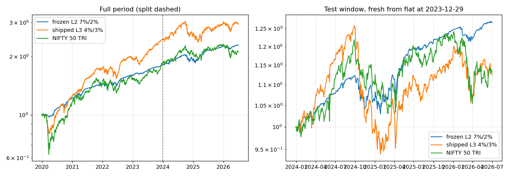

# Walk-forward: frozen L2 / put 7% / call 2% / stop 15%

Generated by `scripts/wheel/walk_forward_frozen.py`. Do not edit by hand.

Fit window 2019-12-31 → 2023-12-29, test window 2023-12-29 → 2026-06-30. The configuration is frozen; nothing is re-fitted at the split. **It was chosen after the full 2020–2026 grid was seen, so the test years are not truly unseen.** The split shows whether the result holds in both halves, not that it was predicted.

## Fit vs test

| window | config | CAGR | vol | Sharpe | max DD | Calmar |
|---|---|---:|---:|---:|---:|---:|
| fit 2020–2023 | L2 put 7% / call 2% / stop 15% | 15.97% | 6.09% | 1.72 | -6.98% | 2.29 |
| fit 2020–2023 | L3 put 4% / call 3% / stop 15% | 25.37% | 13.44% | 1.42 | -20.45% | 1.24 |
| fit 2020–2023 | NIFTY 50 TRI | 16.96% | 20.15% | 0.66 | -38.27% | 0.44 |
| test 2024–2026 (fresh) | L2 put 7% / call 2% / stop 15% | 10.01% | 7.17% | 0.56 | -8.32% | 1.20 |
| test 2024–2026 (fresh) | L3 put 4% / call 3% / stop 15% | 4.83% | 14.83% | -0.01 | -25.32% | 0.19 |
| test 2024–2026 (fresh) | NIFTY 50 TRI | 5.08% | 13.78% | -0.00 | -15.43% | 0.33 |
| test 2024–2026 (continuous) | L2 put 7% / call 2% / stop 15% | 9.98% | 7.77% | 0.52 | -9.52% | 1.05 |
| test 2024–2026 (continuous) | L3 put 4% / call 3% / stop 15% | 7.24% | 14.42% | 0.15 | -22.25% | 0.33 |
| test 2024–2026 (continuous) | NIFTY 50 TRI | 5.08% | 13.78% | -0.00 | -15.43% | 0.33 |
| full 2020–2026 | L2 put 7% / call 2% / stop 15% | 13.63% | 6.78% | 1.18 | -9.52% | 1.43 |
| full 2020–2026 | L3 put 4% / call 3% / stop 15% | 18.05% | 13.82% | 0.91 | -22.25% | 0.81 |
| full 2020–2026 | NIFTY 50 TRI | 12.23% | 17.99% | 0.45 | -38.27% | 0.32 |

## Neighbours (L2, stop 15%)

| config | fit CAGR | fit max DD | test CAGR (fresh) | test max DD | test Sharpe |
|---|---:|---:|---:|---:|---:|
| L2 put 7% / call 2% / stop 15% | 15.97% | -6.98% | 10.01% | -8.32% | 0.56 |
| L2 put 6% / call 2% / stop 15% | 16.23% | -9.06% | 9.45% | -11.90% | 0.39 |
| L2 put 6% / call 3% / stop 15% | 15.92% | -8.08% | 9.05% | -12.77% | 0.34 |
| L2 put 7% / call 3% / stop 15% | 15.47% | -5.84% | 9.52% | -9.17% | 0.47 |

## Year by year

2020–2023 from the full run, 2024–2026 H1 from the fresh test run.

| year | window | frozen L2 7%/2% | shipped L3 4%/3% | NIFTY 50 TRI |
|---|---|---:|---:|---:|
| 2020 | fit | 22.01% | 24.48% | 16.14% |
| 2021 | fit | 17.55% | 39.28% | 25.59% |
| 2022 | fit | 11.94% | 13.29% | 5.69% |
| 2023 | fit | 12.59% | 25.60% | 21.30% |
| 2024 | test | 6.05% | -1.28% | 10.09% |
| 2025 | test | 17.50% | 20.15% | 11.88% |
| 2026 | test | 1.89% | -5.12% | -8.10% |

## Test-window significance (no search)

- P(Sharpe over T-bills ≤ 0), block bootstrap: **0.171**
- P(active return over NIFTY 50 TRI ≤ 0): **0.231**

