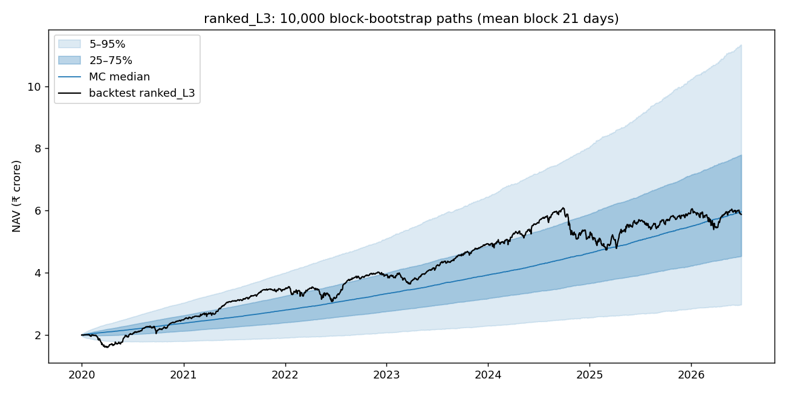
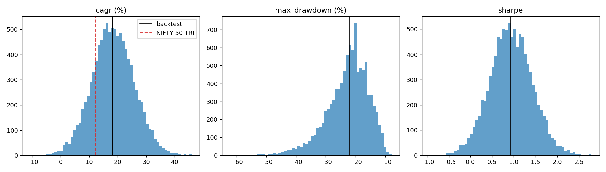
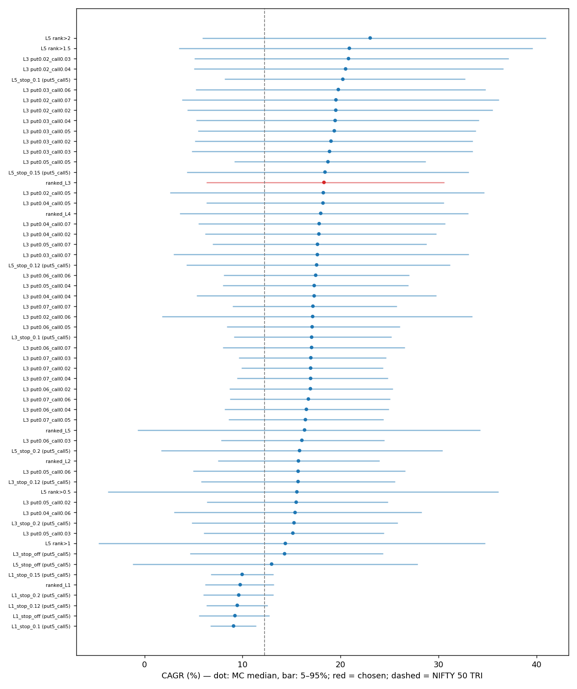
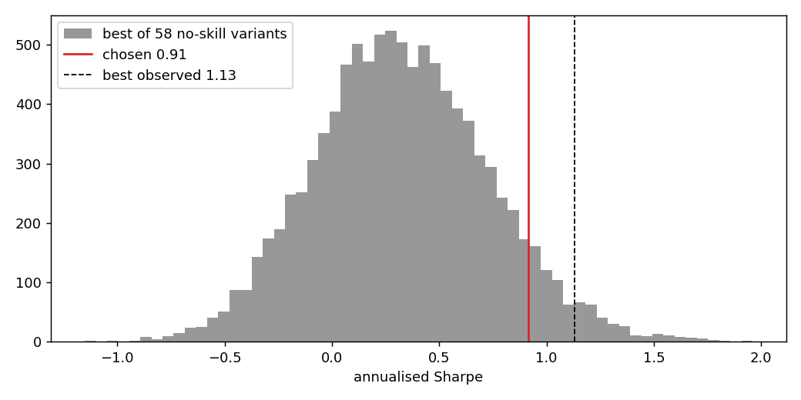

# Monte Carlo: ranked_L3

Generated by `scripts/wheel/monte_carlo.py`. Do not edit by hand. 10,000 paths, seed 20260930, 1604 trading days (2019-12-31 → 2026-06-30).

## The final number

| | backtest | after selection haircut |
|---|---|---|
| CAGR | 18.05% | **14.04%** (90% range 2.32% to 26.58%) |
| Sharpe | 0.91 | **0.72** |
| Max drawdown | -22.25% | 1-in-20 path: **-35.66%** |
| P(CAGR below NIFTY 50 TRI) | | 20% |
| Reality Check p-value (search of 58 variants) | | 0.076 |

- The haircut is the selection optimism from part 3. Put 4% / call 3% was chosen as the best-CAGR cell of the L3 strike grid. On each simulated history, the best-CAGR cell of that grid beats its own average by 4.01% CAGR and 0.19 Sharpe, so that gap is taken off.
- Other pools and criteria in part 3 put the adjusted CAGR between 12.27% and 17.89%. The low end picks by CAGR across all variants, where the noisy L5 runs dominate the winners.
- The 90% range is the bootstrap 5–95% of the chosen run, shifted by the haircut.

## 1. Match checks

- **Metric engine:** the vectorised scorer reproduces `runs/ranked_L3/metrics.json` to 1e-9 on the actual path (CAGR, vol, Sharpe, max DD, Calmar).
- **Bootstrap centre:** the median simulated CAGR / vol / Sharpe are within 1 pp / 1 pp / 0.05 of the backtest (they must be: the simulation draws from the same daily returns).
- **Shared paths:** the chosen run's column in the variant simulation is identical to part 2.
- **Expected-maximum formula:** E[max of 58 null trials] = 2.333σ by formula, 2.305σ by direct simulation.
- **Variant NAVs:** `strike_grid.py` and `stop_loss_probe.py rerun` reproduced their published tables exactly when they were rerun to save daily NAVs.

## 2. Chosen run: return bootstrap (stationary, mean block 21 days)

| metric | backtest | MC median | 5% | 95% | backtest percentile | iid median | iid 5% |
|---|---|---|---|---|---|---|---|
| cagr | 18.05% | 18.31% | 6.33% | 30.59% | 49% | 18.08% | 7.91% |
| annualized_vol | 13.82% | 13.78% | 12.27% | 15.24% | 52% | 13.81% | 13.12% |
| sharpe | 0.91 | 0.93 | 0.14 | 1.75 | 49% | 0.92 | 0.25 |
| max_drawdown | -22.25% | -21.72% | -35.66% | -12.94% | 46% | -17.27% | -27.81% |
| calmar | 0.81 | 0.84 | 0.21 | 2.11 | 48% | 1.05 | 0.32 |

| event (block bootstrap) | probability |
|---|---|
| P(CAGR < NIFTY 50 TRI CAGR) | 19.7% |
| P(CAGR < average T-bill) | 3.7% |
| P(CAGR < 0) | 0.6% |
| P(max DD worse than -30%) | 14.1% |
| P(max DD worse than -40%) | 2.4% |
| P(Sharpe < NIFTY 50 TRI Sharpe) | 15.6% |

- *Backtest percentile* = share of simulated paths below the backtest value. For max drawdown, a low percentile means most reshuffled histories had a *worse* drawdown than the one realised.
- iid resampling destroys volatility clustering and understates drawdowns; read the block columns.

## 3. All 58 variants on the same resampled days

Variants by family (exact duplicates removed): leverage 5, strike grid (L3) 35, stop sweep 14, threshold (L5, older engine) 4. The L5 threshold runs predate the stop-loss and later engine fixes; they are included because they were seen when the threshold was chosen.

| variant | backtest CAGR | MC median CAGR | 5–95% CAGR | backtest Sharpe | MC 5% Sharpe | 1-in-20 max DD | P(CAGR < NIFTY) |
|---|---|---|---|---|---|---|---|
| L5 rank>2 | 22.54% | 23.03% | 5.92% – 40.97% | 0.72 | 0.16 | -52.30% | 15% |
| L5 rank>1.5 | 20.56% | 20.90% | 3.50% – 39.59% | 0.65 | 0.08 | -54.62% | 21% |
| L3 put0.02_call0.03 | 20.42% | 20.82% | 5.09% – 37.14% | 0.89 | 0.08 | -49.01% | 19% |
| ranked_L3 **(chosen)** | 18.05% | 18.31% | 6.33% – 30.59% | 0.91 | 0.14 | -35.66% | 20% |
| ranked_L4 | 17.60% | 17.98% | 3.61% – 33.02% | 0.77 | -0.02 | -46.41% | 25% |
| L3 put0.07_call0.02 | 16.83% | 16.95% | 9.88% – 24.36% | 1.13 | 0.47 | -19.42% | 14% |
| ranked_L5 | 15.86% | 16.33% | -0.68% – 34.25% | 0.60 | -0.19 | -57.78% | 35% |
| ranked_L2 | 15.56% | 15.71% | 7.49% – 23.97% | 0.94 | 0.24 | -24.01% | 24% |
| L1_stop_0.15 (put5_call5) | 9.92% | 9.96% | 6.76% – 13.15% | 0.95 | 0.31 | -8.40% | 88% |
| ranked_L1 | 9.70% | 9.77% | 6.19% – 13.18% | 0.88 | 0.19 | -9.52% | 88% |
| L1_stop_0.12 (put5_call5) | 9.43% | 9.47% | 6.34% – 12.56% | 0.92 | 0.24 | -7.99% | 93% |
| L1_stop_0.1 (put5_call5) | 9.05% | 9.09% | 6.72% – 11.39% | 1.08 | 0.41 | -4.92% | 99% |

Leverage runs, the chosen run, the top 3 by CAGR and top 5 by Calmar shown; all 58 are in `variants.csv`.

**Reality Check (White 2000).** Each variant's excess return is recentred to zero, so every variant has no skill but keeps its own volatility and its correlation with the others. On each path the best Sharpe across all variants is what a pure search would have found.

| | value |
|---|---|
| best no-skill Sharpe, mean | 0.33 |
| best no-skill Sharpe, 95th pct | 1.01 |
| chosen Sharpe | 0.91 → p = 0.076 |
| best observed Sharpe (L3 put0.07_call0.02) | 1.13 → p = 0.029 |
| effective independent trials | 2.7 of 58 |

**Selection optimism.** On each path pick the winner by the criterion, then compare its in-sample value with its average over all paths.

| pool | picked by | CAGR optimism | Sharpe optimism | chosen run wins | most frequent winner | variants that ever win |
|---|---|---|---|---|---|---|
| L3 strike grid (how 4%/3% was picked) | cagr | 4.01% | 0.19 | 1.1% | L3 put0.02_call0.03 (19%) | 35 |
| L3 strike grid (how 4%/3% was picked) | sharpe | 2.79% | 0.19 | 2.5% | L3 put0.07_call0.02 (31%) | 34 |
| all 58 variants | cagr | 5.78% | 0.22 | 0.5% | L5 rank>2 (37%) | 49 |
| all 58 variants | sharpe | 2.94% | 0.23 | 1.4% | L3 put0.07_call0.02 (25%) | 53 |
| all 58 variants | calmar | 0.16% | 0.02 | 0.0% | L1_stop_0.1 (put5_call5) (93%) | 25 |

## 4. Deflated Sharpe Ratio (cross-check)

Chosen-run daily excess returns: skew -0.64, kurtosis 7.2 (normal = 3). Variant Sharpes: mean 0.84, s.d. 0.16.

| trials | hurdle: variant spread (BLdP) | DSR | hurdle: pure noise | DSR vs noise |
|---|---|---|---|---|
| 1 | 0.00 | 98.8% | 0.00 | 98.8% |
| 2.7 (effective, part 3) | 0.12 | 97.5% | 0.31 | 93.1% |
| 5 | 0.18 | 96.4% | 0.48 | 85.7% |
| 10 | 0.24 | 95.1% | 0.64 | 75.3% |
| 20 | 0.29 | 93.7% | 0.77 | 64.0% |
| 58 | 0.36 | 91.4% | 0.94 | 47.1% |

- The formula has to guess the number of independent trials. Part 3 measures it from the variants' correlation, so read the *effective* row.

## 5. What this does not cover

- The bootstrap only reshuffles days that happened in 2020–2026. A crash worse than March 2020 cannot appear, so the left tail is a floor on risk, not a ceiling.
- It resamples portfolio returns, not trades. Path effects inside the engine (assignment chains, margin limits, the stop-loss reacting to a new path) are held at their historical behaviour.
- The variants are resampled on the same calendar, so a variant that happened to dodge one specific bad week keeps that edge in every path. That is why the parameter choice is tested in time separately: `scripts/wheel/walk_forward.py` → WALK_FORWARD.md (fit 2019–2023, test 2024–2026).
