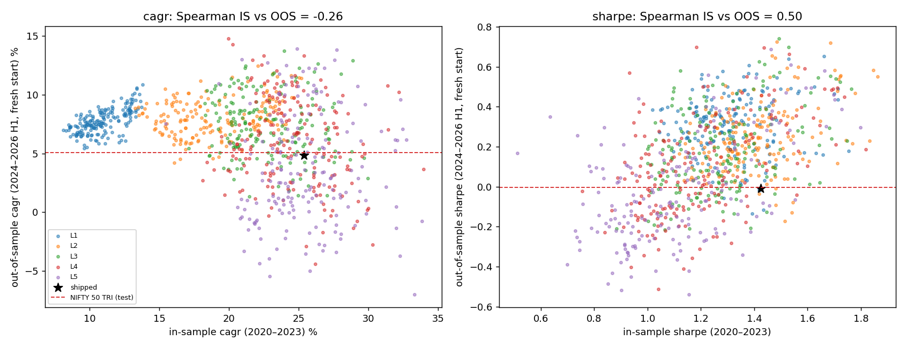
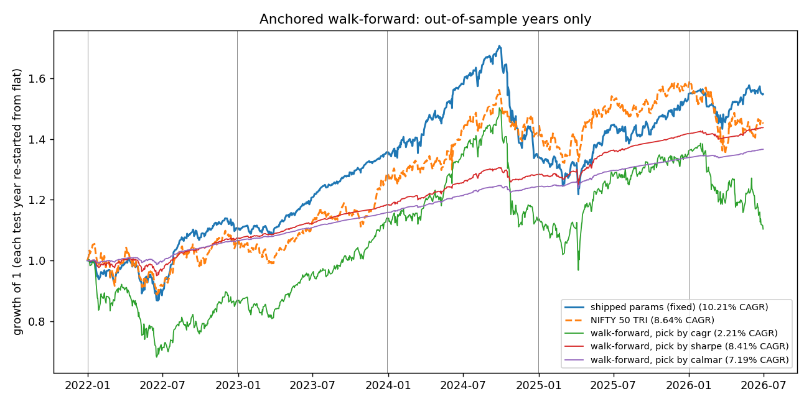
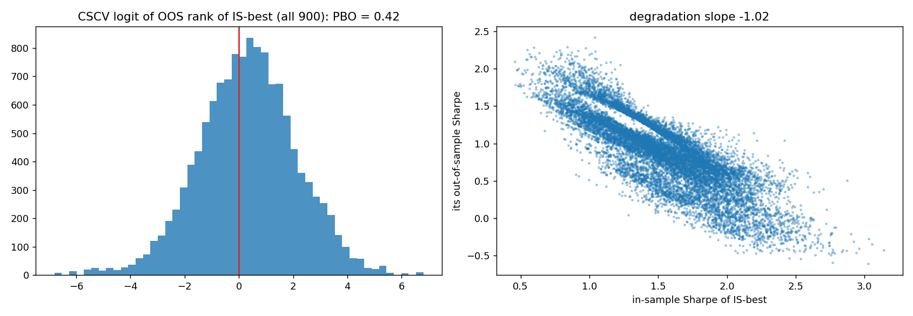

# Out-of-sample test of the parameter choice

Generated by `scripts/wheel/walk_forward.py`. Do not edit by hand. Search space: leverage 1–5 × put 2–7% × call 2–7% × put stop off/10/12/15/20% = 900 configs, every one a full engine run. Shipped = `L3 put 4% / call 3% / stop 15%`. Rank threshold and N stay at params.yaml in every run.

## The answer

| | in sample (2020–2023) | out of sample (2024 → 2026-06, fresh start) |
|---|---|---|
| Shipped params CAGR | 25.37% (rank 189 of 900) | **4.83%** (rank 681 of 900) |
| Shipped params Sharpe | 1.42 | **-0.01** |
| Shipped params max drawdown | -20.45% | -25.32% |
| NIFTY 50 TRI CAGR | 16.96% | 5.08% |
| Average 3M T-bill | | 6.08% |
| Rank correlation, in-sample vs out-of-sample CAGR (900 configs) | | -0.26 |
| Probability of backtest overfitting (CSCV, Sharpe, 900 configs) | | 0.42 |
| Anchored walk-forward 2022–2026 H1, pick by CAGR each year | | 2.21% CAGR vs shipped 10.21% vs NIFTY 8.64% |
| Reality Check p (58 variants, published) | 0.076 → reproduced 0.076; range over seeds × block lengths 0.053–0.083 | |
| No-search test: shipped OOS Sharpe ≤ 0 | | p = 0.517 |
| No-search test: shipped OOS beats NIFTY 50 TRI? (p for active Sharpe ≤ 0) | | p = 0.523 |

**Reading.**

- **The shipped params did not hold up out of sample.** Fitted on 2020–2023 they would have made 25.37%; from flat on 2024-01 they made 4.83%, below the T-bill (6.08%) and level with NIFTY (5.08%), with a -25.32% drawdown. Out of sample they rank 681 of 900.
- **Picking by CAGR is what fails.** The in-sample CAGR winner lands at the 19% percentile out of sample. Walk-forward by CAGR earns 2.21% a year. Picking by Sharpe at 3× earns 9.82%, Sharpe 0.61, max DD -9.17%. Its yearly picks: put 7% / stop 10% ×4, put 7% / stop 12% ×1.
- **The case for the shipped params:** run fixed through the same test years, they made 10.21% a year vs NIFTY 8.64%, ahead of every walk-forward stream on CAGR. PBO is 0.42, below the 0.5 coin-flip line. And one regime break (a strong 2020–2023 bull market, then the Sep 2024 → Feb 2025 sell-off) can reverse CAGR ranks without any curve-fitting, because leverage and tight puts simply pay in rallies and lose in sell-offs.
- **Why that case is weaker:** the fixed-params stream was chosen with those years in view, so it is not evidence. Its Sharpe (0.39) and drawdown (-28.69%) are worse than the Sharpe-picked walk-forward's. A regime explanation also means the CAGR-optimal setting depends on a regime nobody can call in advance, which is the practical meaning of "not validated".

## 1. The pre-registered split (fit 2019-12-31 → 2023-12-29, test 2024-01-01 → 2026-06-30)

Every config is re-run from flat at the split, so no position opened in the fit window leaks into the test. The *continuous* column is the same window cut out of the full-period run (positions carried in) for comparison: shipped 7.24%.

**Who would have been picked on 2020–2023, and what they then did**

| pool | picked by | winner | IS CAGR | IS Sharpe | OOS CAGR | OOS Sharpe | OOS max DD | OOS percentile on that criterion | pool OOS median CAGR |
|---|---|---|---|---|---|---|---|---|---|
| all 900 | cagr | L4 put 2% / call 5% / stop 15% | 33.96% | 1.26 | 3.67% | -0.04 | -34.93% | 19% | 7.23% |
| all 900 | sharpe | L2 put 7% / call 3% / stop 10% | 13.53% | 1.86 | 8.28% | 0.55 | -3.60% | 96% | 7.23% |
| all 900 | calmar | L1 put 7% / call 3% / stop 10% | 8.31% | 1.71 | 6.92% | 0.44 | -1.79% | 99% | 7.23% |
| L3 only (180) | cagr | L3 put 2% / call 3% / stop 12% | 29.94% | 1.32 | 2.90% | -0.14 | -27.64% | 5% | 7.22% |
| L3 only (180) | sharpe | L3 put 7% / call 3% / stop 10% | 18.98% | 1.76 | 9.11% | 0.49 | -7.88% | 90% | 7.22% |
| L3 only (180) | calmar | L3 put 7% / call 3% / stop 10% | 18.98% | 1.76 | 9.11% | 0.49 | -7.88% | 96% | 7.22% |

Shipped params out of sample: CAGR percentile 24% of all 900, 19% of the L3 configs; Sharpe percentile 24%.

**Does in-sample rank predict out-of-sample rank?** (Spearman across configs)

| pool | CAGR | Sharpe | Calmar |
|---|---|---|---|
| all 900 | -0.26 | 0.50 | 0.80 |
| L3 only (180) | -0.15 | 0.30 | 0.50 |

- **CAGR ranks reverse** (-0.26 across all 900, -0.15 within L3). CAGR is how put 4% / call 3% was picked from the strike grid, and how 3× was preferred to 2×.
- **Sharpe and Calmar ranks persist**, but across all 900 that is largely leverage: low-leverage, far-OTM configs have the best risk ratios in both windows. Within L3 (same leverage, so only strikes and stop differ) the persistence is weaker: 0.30 for Sharpe, 0.50 for Calmar.

## 2. Anchored walk-forward (annual re-fit, each test year started from flat)

| test year | fit window | winner by CAGR | its return | winner by Calmar | its return | shipped return | NIFTY 50 TRI | grid median (continuous) |
|---|---|---|---|---|---|---|---|---|
| 2022 | 2019-12-31 → 2021-12-31 | L5 put 2% / call 7% / stop off | -13.20% | L1 put 7% / call 3% / stop 12% | 6.54% | 10.50% | 5.69% | 8.47% |
| 2023 | 2019-12-31 → 2022-12-30 | L5 put 2% / call 7% / stop 10% | 31.32% | L1 put 7% / call 3% / stop 10% | 8.68% | 22.79% | 21.30% | 21.33% |
| 2024 | 2019-12-31 → 2023-12-29 | L4 put 2% / call 5% / stop 15% | -0.41% | L1 put 7% / call 3% / stop 10% | 7.42% | -1.28% | 10.09% | 5.45% |
| 2025 | 2019-12-31 → 2024-12-31 | L5 put 2% / call 7% / stop off | 19.95% | L1 put 7% / call 2% / stop 10% | 7.66% | 15.64% | 11.88% | 14.69% |
| 2026 | 2019-12-31 → 2025-12-31 | L5 put 2% / call 2% / stop off | -18.98% | L1 put 7% / call 3% / stop 10% | 2.03% | -0.04% | -8.10% | -2.36% |

**Stitched out-of-sample years**

| stream | CAGR | Sharpe | max DD | Calmar |
|---|---|---|---|---|
| shipped params (fixed) | 10.21% | 0.39 | -28.69% | 0.36 |
| NIFTY 50 TRI | 8.64% | 0.25 | -15.84% | 0.55 |
| walk-forward, pick by cagr | 2.21% | -0.10 | -35.62% | 0.06 |
| walk-forward, pick by sharpe | 8.41% | 0.59 | -5.63% | 1.49 |
| walk-forward, pick by calmar | 7.19% | 0.62 | -2.21% | 3.25 |
| L3 walk-forward, pick by cagr | 3.18% | -0.12 | -31.60% | 0.10 |
| L3 walk-forward, pick by sharpe | 9.82% | 0.61 | -9.17% | 1.07 |
| L3 walk-forward, pick by calmar | 9.82% | 0.61 | -9.17% | 1.07 |

- 31 fresh engine runs. Each test year starts from cash; positions still open at year-end are marked to market. Every stream (shipped included) is restarted the same way.
- The *shipped* stream is not a walk-forward: its params were chosen with the 2022–2026 data in view. It is the benchmark the walk-forward has to be compared with, not a validation of itself.

## 3. Probability of backtest overfitting (CSCV, 16 blocks, 12,870 splits, Sharpe)

| pool | PBO | median logit | IS-best Sharpe (mean) | its OOS Sharpe (mean) | P(OOS Sharpe < 0) | degradation slope |
|---|---|---|---|---|---|---|
| all 900 | **0.42** | 0.35 | 1.53 | 0.88 | 5% | -1.02 |
| L3 only (180) | **0.41** | 0.53 | 1.43 | 0.92 | 4% | -1.07 |

- PBO is the share of splits where the in-sample best config lands in the *bottom half* out of sample. 0.5 means picking the best is no better than picking at random; below 0.5 the search carries information.
- CSCV shuffles calendar blocks, so unlike part 2 it lets the test half sit before the fit half. It answers "is the ranking stable across sub-periods", not "does it hold in the future".

## 4. The Reality Check p = 0.076, re-examined

- **Reproduced exactly.** Re-drawing monte_carlo.py's first 10,000 block-21 paths with seed 20260930 gives p = 0.0763 for the shipped run (published 0.0763); 0.0295 for the best observed variant.
- **It is not a fixed number.** Over 5 seeds × block lengths 5–63 days the shipped p ranges 0.053–0.083:

| mean block (days) | p, mean of 5 seeds | min | max |
|---|---|---|---|
| 5 | 0.059 | 0.053 | 0.066 |
| 10 | 0.068 | 0.062 | 0.074 |
| 21 | 0.075 | 0.073 | 0.079 |
| 42 | 0.076 | 0.068 | 0.081 |
| 63 | 0.077 | 0.073 | 0.083 |

- **What it tests.** The null is *no variant beats the T-bill*. That is a low bar for a 3×-levered short-volatility book; the question an allocator asks is whether it beats the index. The table below runs White's Reality Check and Hansen's SPA on mean daily excess return against both benchmarks, on the 58 variants actually seen and on the 900-config grid.

| benchmark | pool | RC p | SPA_c p | SPA_u p | variants clearly worse than benchmark | best variant |
|---|---|---|---|---|---|---|
| T-bill | 58 variants seen before the choice | 0.051 | 0.010 | 0.010 | 0 of 58 | L5 rank>2 |
| T-bill | 900-config walk-forward grid | 0.128 | 0.008 | 0.008 | 0 of 900 | L5_p0.02_c0.02_soff |
| NIFTY 50 TRI | 58 variants seen before the choice | 0.186 | 0.316 | 0.316 | 0 of 58 | L5 rank>2 |
| NIFTY 50 TRI | 900-config walk-forward grid | 0.402 | 0.331 | 0.331 | 0 of 900 | L5_p0.02_c0.02_soff |

- SPA_c is Hansen's consistent version: it studentises each variant and leaves out of the null those clearly worse than the benchmark, so it is less conservative than RC. SPA_u (no exclusion) is the upper bound.
- **No search, out of sample.** Testing only the shipped config on 2024–2026 (fresh start) is one hypothesis, so no multiple-testing penalty applies: p(Sharpe ≤ 0 vs T-bill) = 0.517, p(no outperformance of NIFTY 50 TRI) = 0.523. Caveat: the 2024–2026 data *was* in the full-window backtest used to choose them, so this is out-of-sample for this test's split, not a genuinely unseen period.

## 5. Limits

- The only data never used to choose anything is data after 2026-06-30. Everything here is a re-analysis of a window the parameters were already fitted on; it can show the choice is fragile, it cannot fully clear it. A paper or small-size live period is the only clean out-of-sample test left.
- Rank threshold (1.5) and N (20) were also chosen in-sample and are held fixed here.
- Two and a half test years contain one major drawdown (Sep 2024 → Feb 2025). One episode dominates the out-of-sample number; a different split would weigh it differently, which is why part 2 and part 3 exist.
